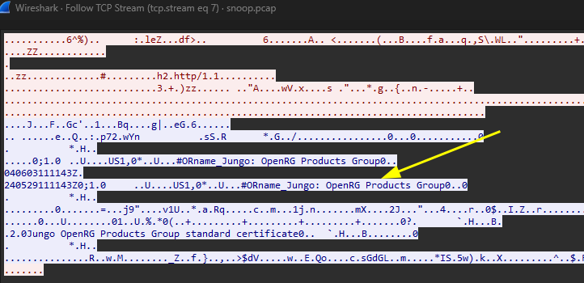
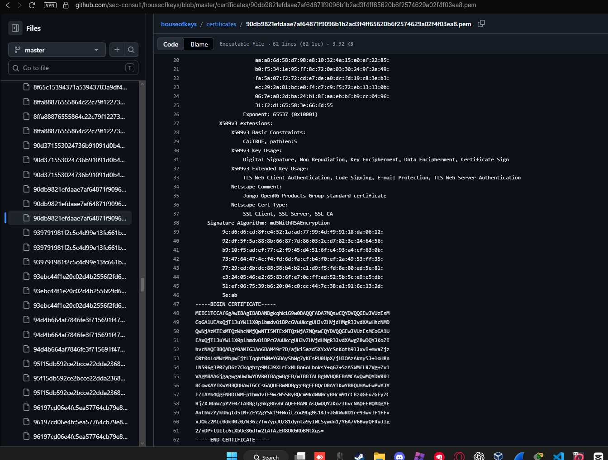
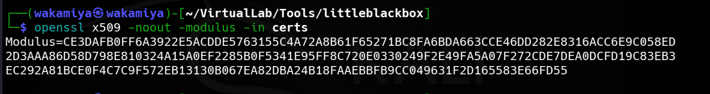
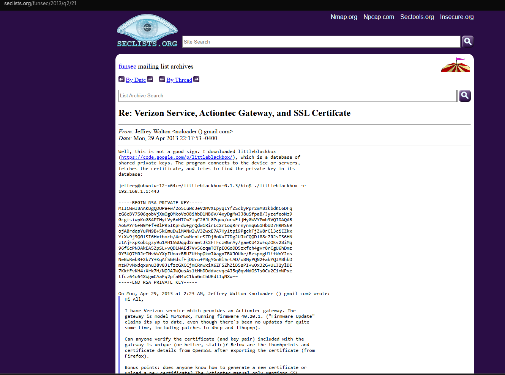
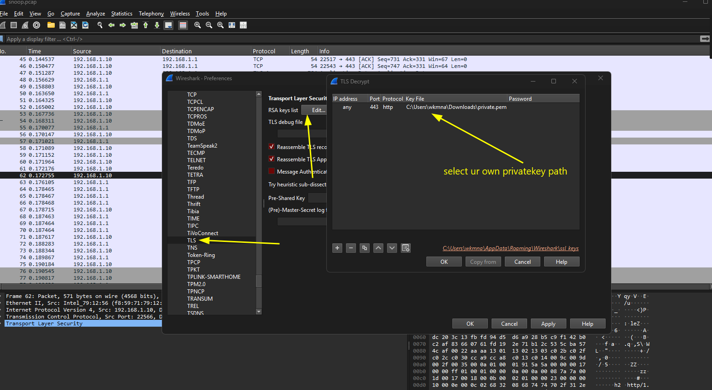
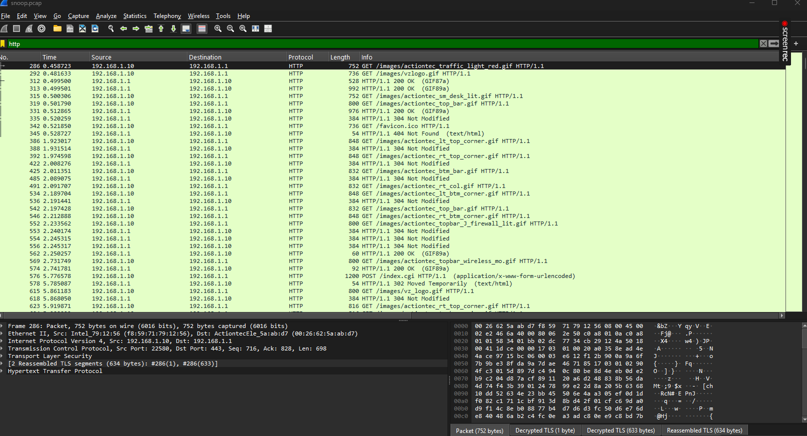
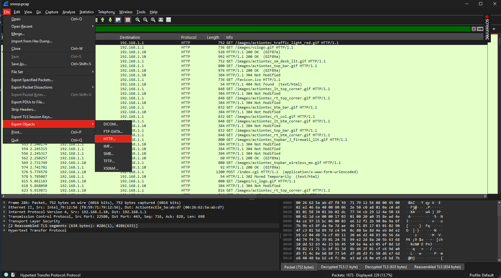
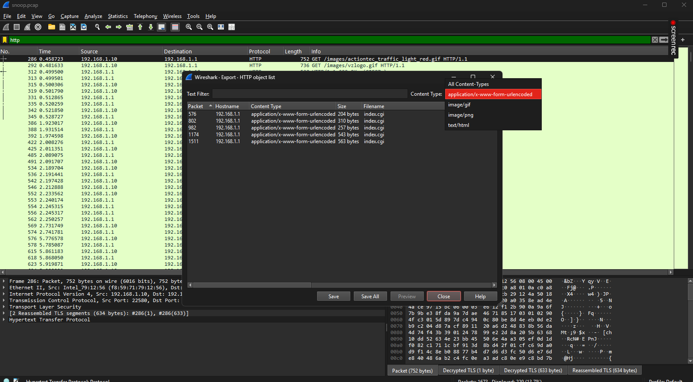
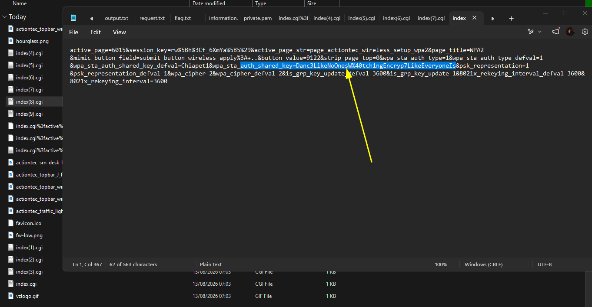

# SkillsBit CTF — Decrypting SSL/TLS traffic using Wireshark and private keys

## Introduction

This CTF is from the **SkillsBit** platform, with the main topic being **Reconnaissance**.

However, this challenge is more focused on **Network Forensics**. Everything started from a file called `snoop.pcap`, which contained encrypted communication traffic. At first, I could see the communication between the client and the server, but I could not understand what the traffic meant because most of it was encrypted.

The goal was to investigate the traffic, find useful clues, decrypt the communication, and eventually find the flag.

---

## 1. Analyzing `snoop.pcap`

I started by opening `snoop.pcap` in **Wireshark** and analyzing the captured traffic.

Most of the communication was encrypted, so there was not much useful information that could be read directly.

While looking through the packets, I noticed one interesting packet where the client started a connection with a **Client Hello**.

When I checked the packet content, I found this string:

```text
Jungo: OpenRG
```


This caught my attention, so I decided to investigate what **Jungo OpenRG** actually was.

---

## 2. Investigating Jungo OpenRG

I searched for information about `Jungo: OpenRG` and found that **OpenRG** is a software platform developed by **Jungo**.

It is designed for developing **residential gateway** and **SOHO gateway** devices, including home routers, wireless devices, and IP/VoIP gateway devices.


This gave me an important clue about the technology used by the device or server in the captured communication.

However, I still needed a way to decrypt the encrypted traffic.

---

## 3. Finding the Certificate

While continuing the investigation, I found a GitHub repository called **House of Keys**.

The repository contains information about digital certificates and private keys related to different devices and software.



I started looking for a certificate related to **Jungo OpenRG**.

After finding a possible certificate, I checked its information and copied some parts of the certificate for further investigation.

---

## 4. Finding the Leaked Private Key

While searching for more information about the certificate, I found an article discussing a **leaked private key**.

The article explained that the leaked private key could be matched with its corresponding certificate using a tool called **LittleBlackBox**.

Before using the private key for decryption, I wanted to make sure that the certificate I found was actually valid and related to the key.

I used `openssl` to inspect and verify the certificate.



After confirming that the certificate was valid and matched the information I was looking for, I copied the private key mentioned in the article.



Now I had two important pieces of information:

- The certificate used by the communication.
- The private key that matched the certificate.

The next step was to use the private key to decrypt the captured network traffic.

---

## 5. Decrypting the Traffic

I then configured Wireshark to use the private key for TLS decryption. edit>preferences>protocols>TLS>RSA keys list and choose edit



After configuring the key, I checked the traffic again to see if Wireshark could decrypt the previously encrypted communication.



After the decryption worked, I could finally see the protocols and data inside the communication instead of only seeing encrypted TLS packets.

This was an important step because I could now investigate the actual application traffic.

---
## 7. Exporting HTTP Objects

There were quite a lot of HTTP packets, so manually checking every packet would take a lot of time.

I needed a more efficient way to extract the useful data from the HTTP traffic.

While looking for a better way to analyze the traffic, I found that Wireshark has a useful feature called **Export HTTP Objects**.

This feature allows us to extract objects transferred through HTTP instead of manually checking every packet.

I opened:

```text
File → Export Objects → HTTP
```



From the list of HTTP objects, I focused on the objects using:

```text
application/x-www-form-urlencoded
```



I selected the relevant objects and exported them to a folder so I could analyze them separately.

This made the investigation much easier because I could work directly with the extracted data instead of going through all of the packets manually.

---

## 8. Finding the Flag

After exporting the HTTP objects, I started checking the extracted files and their contents.

Eventually, I found the data containing the flag.



The flag was:

```text
Danc3LikeNoOnesW%40tch1ngEncryp7LikeEveryoneIs
```

---

## Conclusion

This challenge started as a reconnaissance challenge, but most of the actual investigation was related to **network forensics and encrypted traffic analysis**.

The overall process was:

```text
snoop.pcap
    ↓
Analyze traffic with Wireshark
    ↓
Find "Jungo: OpenRG"
    ↓
Research Jungo OpenRG
    ↓
Find the related certificate
    ↓
Discover House of Keys
    ↓
Find the leaked private key
    ↓
Verify the certificate with OpenSSL
    ↓
Import the private key into Wireshark
    ↓
Decrypt the TLS traffic
    ↓
Filter HTTP traffic
    ↓
Export HTTP Objects
    ↓
Analyze x-www-form-urlencoded data
    ↓
Find the flag
```

### Tools Used

- Wireshark
- OpenSSL
- LittleBlackBox
- House of Keys
- Browser / Search Engine

The most interesting part of this challenge was how a small clue inside the **Client Hello** packet, `Jungo: OpenRG`, eventually led to the certificate and private key needed to decrypt the traffic.

It was a good example of how a small piece of information found during network reconnaissance can be used to uncover much more information during further investigation.
